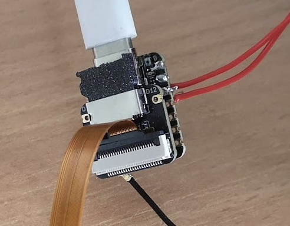
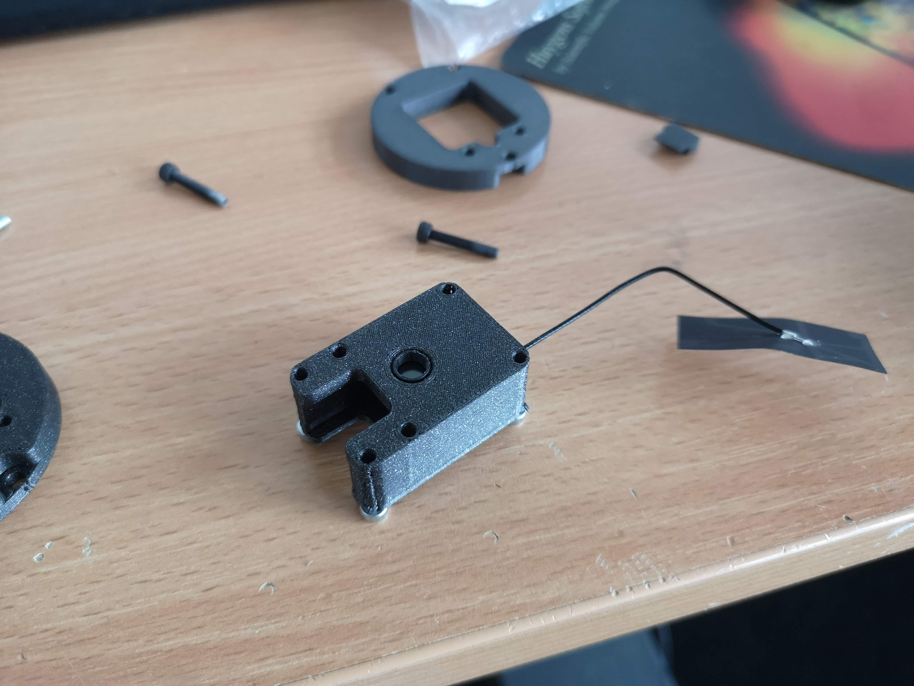
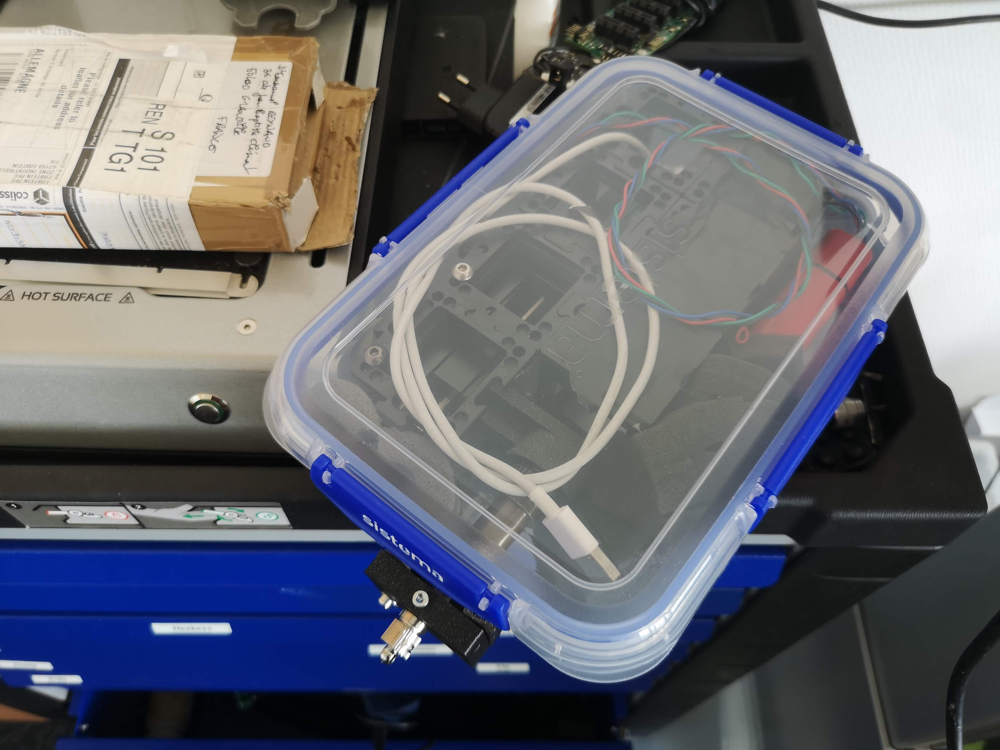

# ESP32 CAM based on the SEEED Studio Xiao Sense

We all like the ESP32-CAM because it is dead-cheap. However, this comes with a huge drawback: The quality of these devices is variable, also it was said that the power management of this device is not ideal due to some groundplane mismatch. The good thing: there are alternatives.
Recently, Seeed Studio presented the new XIAO Sense series. It's the same camera (OV2650), but with a more powerful ESP32S3 and a much smaller footprint. To have a quick fix, we create an adapter that encapsulates the XIAO into the ESP32-CAM (AI Tinker) formfactor. You can use the same software, but have to flash the **XIAO** version from the flashing webpage. Everything else, remains the same.

Our experience so far is: Awesome! No more glitches, reboots or weird behaviours. It just works. Attention: This "beast" gets warm. But as the engineers from Seeed described it: It's due to its powerfuliness :D

## Assembly

Some images that describe how the XIAO adapts to the ESP32-CAM formfactor

There is a small dummy SD-card so that the XIAO remains in place. If you use a micro-SD card you won't need this addon:

The camera goes in the same place as the bigger predecor:

The whole assembly is fixed with 4 M3x12mm screws (or something similar), make sure the Wifi antenna is placed at some place that vertical to the XIAO's operation. Check before assembling everything. Sometimes the wifi signal becomes weak.

## STLs

You need the following items:

- [The Base housing](./IMAGES/seeed/Assembly_Cube_SEEED_Xiao_Sense_Camera_adapter_v3_00_ESP32_XIAO_Adapter_base_2.stl)
- [The Lid for the housing](./IMAGES/seeed/Assembly_Cube_SEEED_Xiao_Sense_Camera_adapter_v3_00_ESP32_XIAO_Adapter_lid_3.stl)
- [The dummy SD-card](./IMAGES/seeed/Assembly_Cube_SEEED_Xiao_Sense_Camera_adapter_v3_00_ESP32_XIAO_Adapter_SDcard_4.stl)
- [A dummy xiao Model](./IMAGES/seeed/Assembly_Cube_SEEED_Xiao_Sense_Camera_adapter_v3_00_Seeeduino_Xiao_1.stl)

All files as a [ZIP](./IMAGES/seeed/Archiv.zip)

## openUC2

You can also build you **ANGLERFISH** using cubes. Please head over to the openUC2 repository for having a look at the dedicated Module.

The [OpenUC2 Repo](https://github.com/openUC2/openUC2-SEEED-XIAO-Camera)

In experiment:

