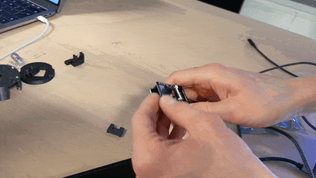
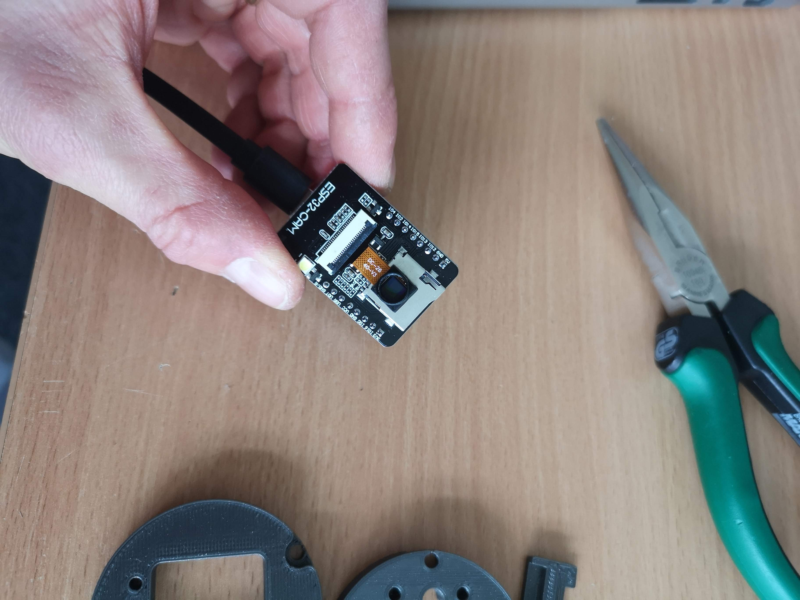
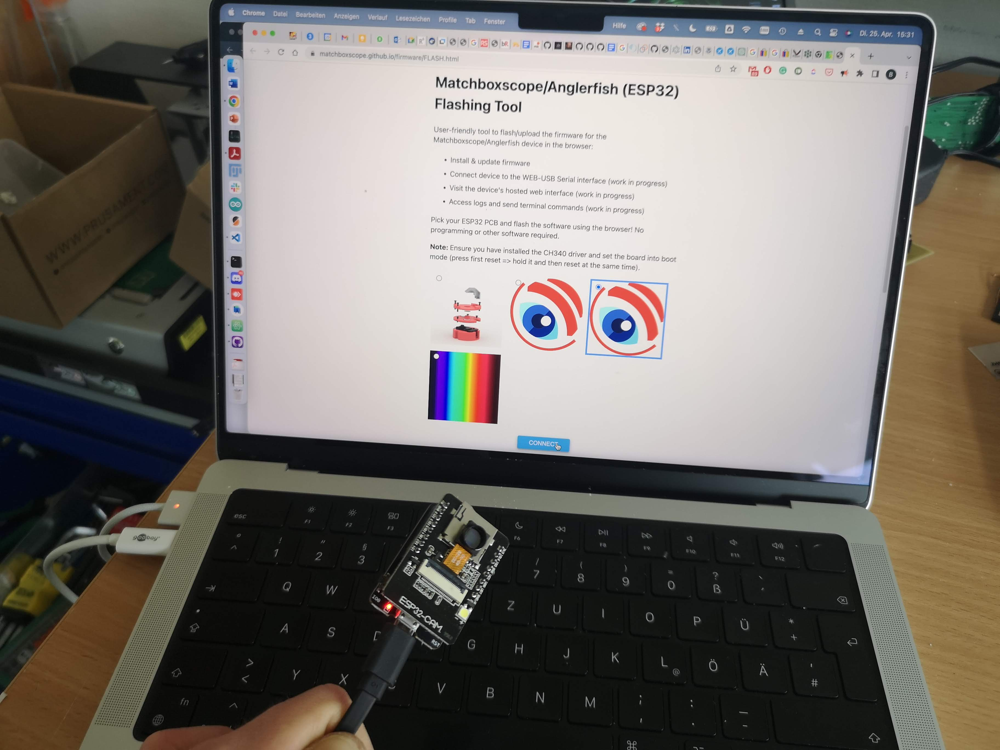
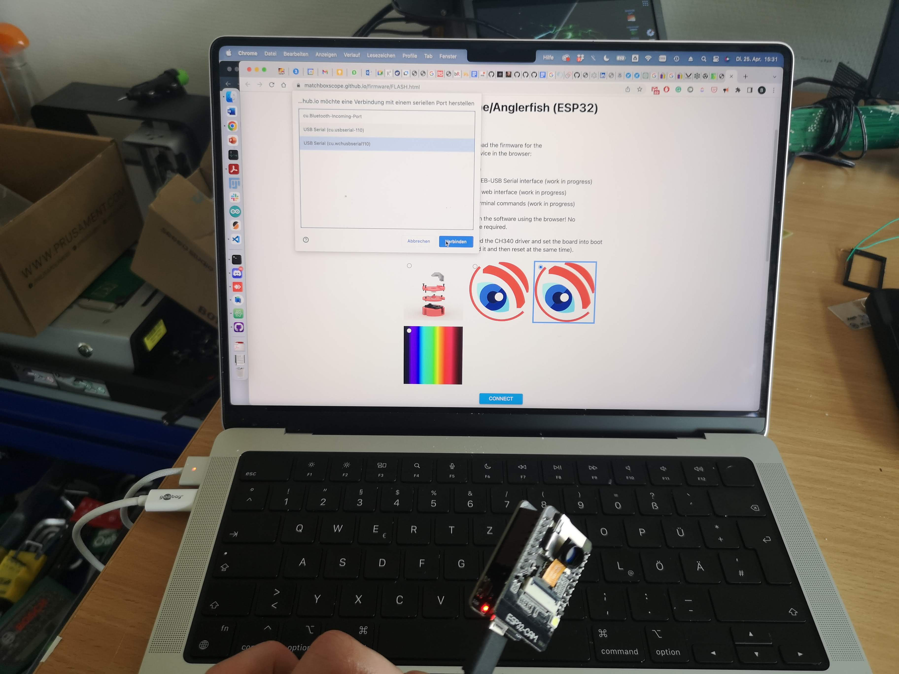
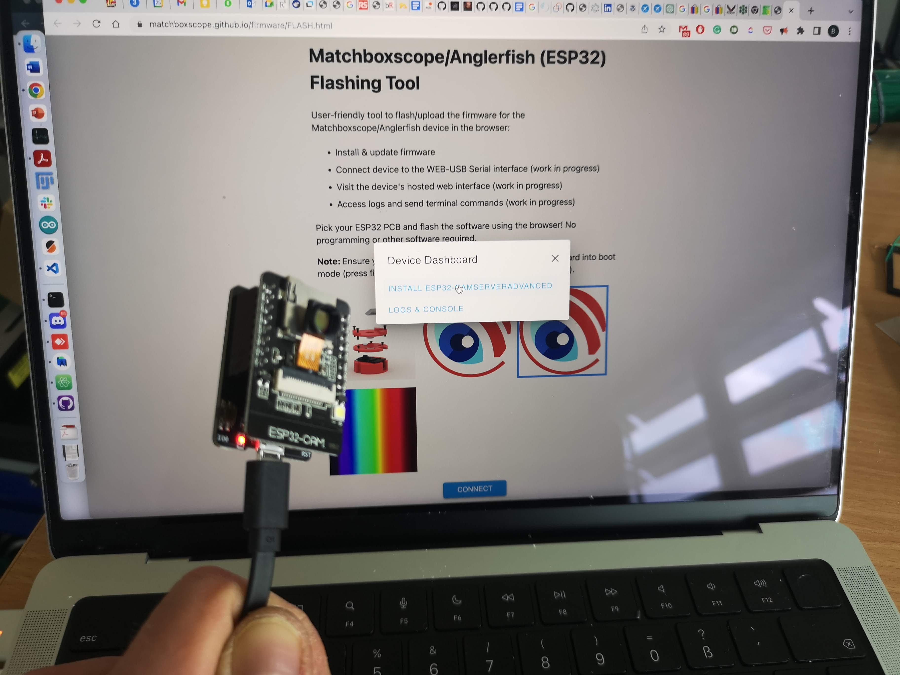
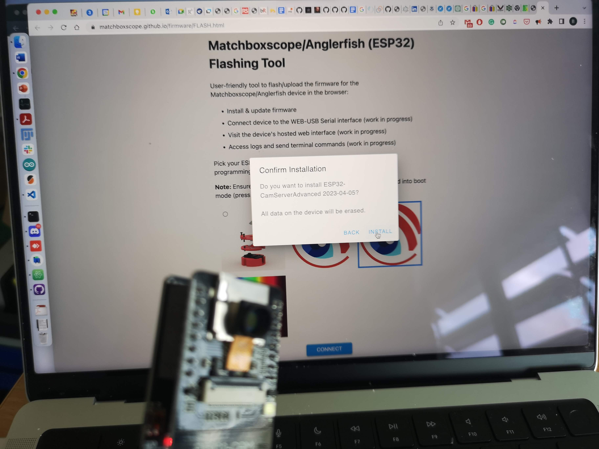
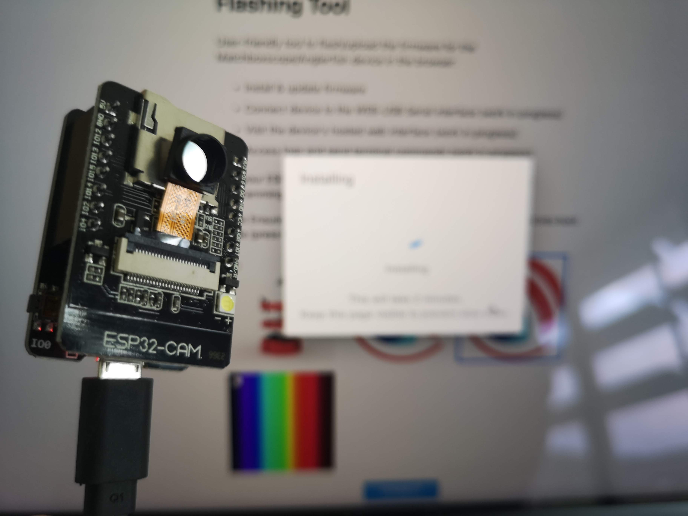
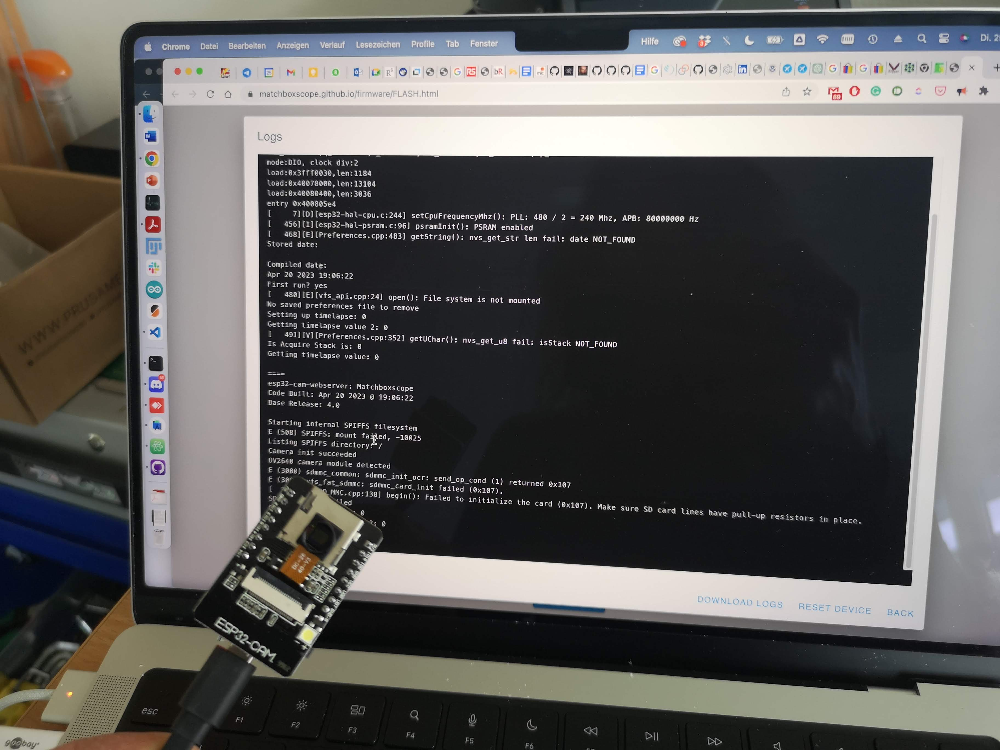
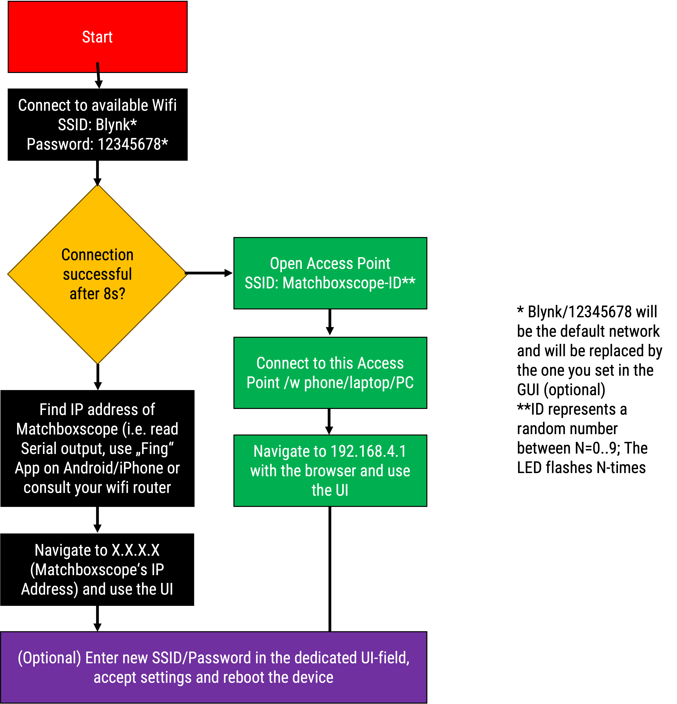

:::info
Instead of flashing the firmware - which may become tricky, especially if you have troubles with:
- the browser not connecting to the device (e.g. firmware issues, driver issues)
- installation of drivers not possible
- usb cable doesn't work
- ESP32-CAM board behaves weird (99% of the time this is the case..)
you can use the **standard firmware/preflashed software** and simply connect the device to USB-power and search for the access point the device creates by default (e.g. *ESP32-XXXX* and go to http://192.168.4.1, you will see some very nice GUI :-) )
:::


:::warning
***UPDATE*** We have created a quick video to show every step from connecting the device to displaying the video on screen. Please consider watching the following [**YOUTUBE VIDEO**](https://youtu.be/ji-f1ymRpAs).
:::
<iframe width="560" height="315" src="https://www.youtube.com/embed/ji-f1ymRpAs" title="YouTube video player" frameborder="0" allow="accelerometer; autoplay; clipboard-write; encrypted-media; gyroscope; picture-in-picture; web-share" allowfullscreen></iframe>


### Step-by-step guide

1. Connect the ESP32-CAM board to the USB and press the ***RESET*** (in the rear of the ESP32-CAM board) and ***BOOT*** (or sometimes ***IO0***) button (on the USB-side). Then first release the ***RESET*** and then the ***BOOT*** button. The device will be in `download mode`

In motion (push RST -> CAM board, push Boot/IO0 Serial board, release RST, release Boot)


2. Go to https://matchboxscope.github.io/firmware/FLASH.html and select the `ESP32 Camera Simple Webcam Server Advanced` firmware


3. Hit the `Connect` button and select the ESP32-CAM


4. Select `Install ESP32...`


5. Hit `Install`


6. Wait for it...


7. Open the serial Minitor afterwards and hit the ```RESET```button on the ESP32


8. The output should look something like this


9. By default the ESP32 will connect to a WIFI hotspot using the following default:

```
SSID: Blynk
PW: 12345678
```

If this is not available, it will create a stand-alone Access Point (AP) to which you would need to connect to with your cellphone/tablet/PC/laptop... The address to reach the device becomes http://192.168.4.1

You can add your own by setting it in the GUI. The following flow-chart gives more insight :




The firmware is based on this code: https://github.com/Matchboxscope/matchboxscope-simplecamera/tree/matchboxscope and now heavily modified.


10. finding the ESP in the network may become tricky. You can install the Fing APP (https://play.google.com/store/apps/details?id=com.overlook.android.fing) and scan your local network for its IP. In case you prepared an access point (AP) using Windows, you can spot the IP address in the hotspot  settings.

### Creating an access point / wifi hotspot

You can use the Android AP or Windows hotspot, perhaps also the iPhone thingy to create an access point with the following credentials:
```
SSID: Blynk
PW: 12345678
```
and the ESP32 will automatically connect

The log will look like this:

```
Connecting to Wifi Network 1: [F6:D1:08:4A:51:F0] Blynk
[ 13000][V][WiFiGeneric.cpp:97] set_esp_interface_ip(): Configuring Station static IP: 0.0.0.0, MASK: 0.0.0.0, GW: 0.0.0.0
.[ 13632][V][WiFiGeneric.cpp:355] _arduino_event_cb(): STA Connected: SSID: Blynk, BSSID: f6:d1:08:4a:51:f0, Channel: 1, Auth: WPA2_PSK
[ 13633][D][WiFiGeneric.cpp:931] _eventCallback(): Arduino Event: 4 - STA_CONNECTED
[ 13674][V][WiFiGeneric.cpp:369] _arduino_event_cb(): STA Got New IP:192.168.137.217
[ 13675][D][WiFiGeneric.cpp:931] _eventCallback(): Arduino Event: 7 - STA_GOT_IP
[ 13678][D][WiFiGeneric.cpp:996] _eventCallback(): STA IP: 192.168.137.217, MASK: 255.255.255.0, GW: 192.168.137.1
.Client connection succeeded
IP address: 192.168.137.217
Netmask   : 255.255.255.0
Gateway   : 192.168.137.1
Setting httpURL
Setting up OTA

No OTA password has been set! (insecure)

[ 16024][I][ArduinoOTA.cpp:141] begin(): OTA server at: Matchboxscope.local:3232
Added HTTP service to MDNS server
Time functions disabled
Starting web server on port: '80'
Starting stream server on port: '81'

Camera Ready!
Use 'http://192.168.137.217/' to connect
Stream viewer available at 'http://192.168.137.217:81/view'
Raw stream URL is 'http://192.168.137.217:81/'
Camera debug data is disabled (send 'd' for status dump, or any other char to enable debug)
```

Go to the device's ip address, in this case  http://192.168.137.217/ and open the stream.
### Troubleshoot

#### Not connecting
Possible causes:
- Did you install the driver/is the driver installed (Usually it's preinstalled in Windows/Mac)
- Antivirus software running?
- USB Cable is actually a data-cable not a charging-only cable?

#### Not connecting via Wifi
- on Android (perhaps iPhone too?) it's a known behaviour; Make sure **mobile data** is switched off when you connect to the access point created by the ESP32 camera

#### Stream stops
- lower the resolution (e.g. VGA)
- reflash the firmware

#### Bootloop
Causes:
- faulty esp32 camera
- error while uploading firmware
- camera broken
Solutions:
- reflash the firmware
- get a new board
- get a new camera module
