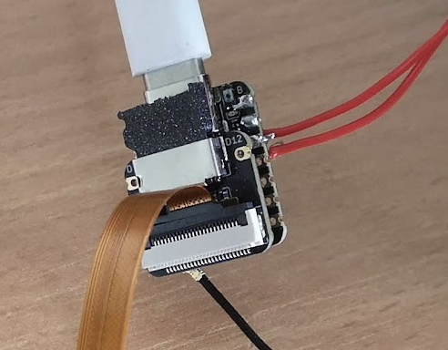
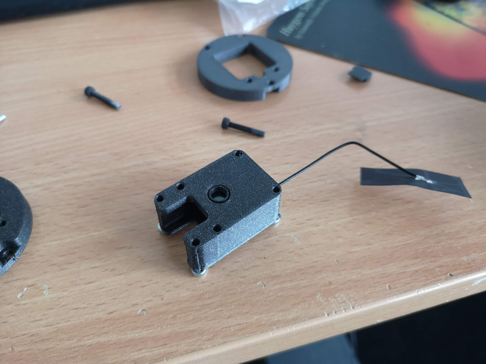
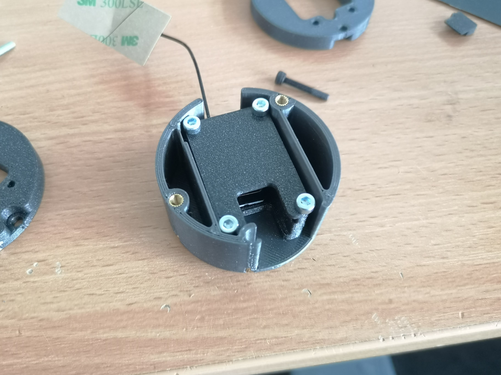
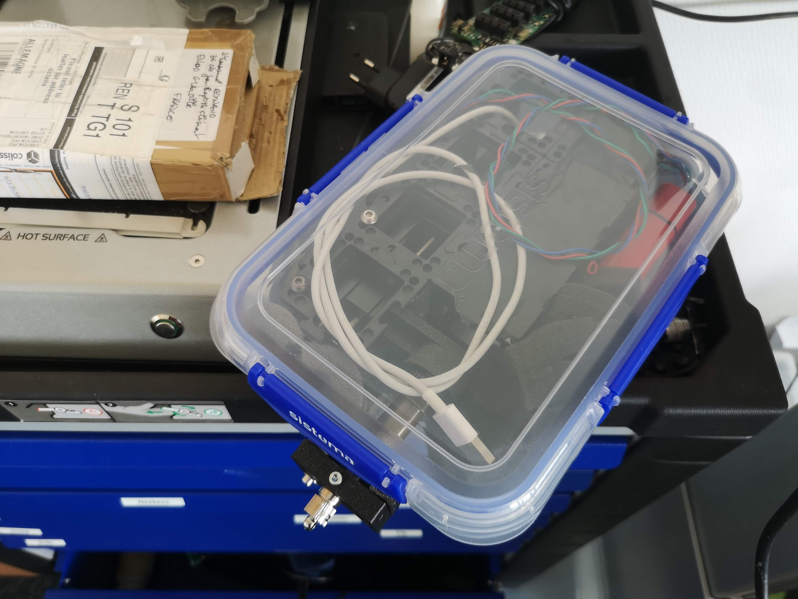

# Seeed Studio XIAO ESP32S3 Sense - Advanced Development Board

The Seeed Studio XIAO ESP32S3 Sense is a powerful development board that builds upon the capabilities of the ESP32 microcontroller, offering advanced features for a wide range of applications. With integrated WiFi, Bluetooth, a high-resolution camera sensor, digital microphone, and more, this board provides a versatile platform for intelligent voice and vision AI projects.

## Key Features

1. **Powerful Processing**: The XIAO ESP32S3 Sense utilizes the ESP32S3 32-bit, dual-core Xtensa processor chip operating at up to 240 MHz. This robust processing power is accompanied by multiple development ports, ensuring compatibility with Arduino and MicroPython programming environments.

2. **Integrated Camera**: The board includes a detachable OV2640 camera sensor capable of capturing images at 1600x1200 resolution. Additionally, the base supports OV5640 camera sensors, enabling even higher resolutions of up to 2592x1944.

3. **Digital Microphone**: An integrated digital microphone facilitates voice sensing and audio recognition, enhancing the board's capabilities for interactive projects.

4. **Ample Memory**: The XIAO ESP32S3 Sense offers 8MB of PSRAM and 8MB of FLASH memory, providing substantial storage and programming space. The board also features an external SD card slot compatible with up to 32GB FAT memory, further expanding its memory capacity.

5. **Wireless Communication**: With support for 2.4GHz WiFi and Bluetooth Low Energy (BLE) 5.0 dual-mode communication, the board offers reliable wireless connectivity. When connected to a U.FL antenna, it can achieve remote communication ranges of over 100 meters.

6. **Compact Design**: The board maintains the classic thumb-sized form factor found in the XIAO series, measuring 21 x 17.5mm. This compact design is particularly suitable for space-limited projects, including wearables and IoT applications.

# ESP32 CAM based on the SEEED Studio Xiao Sense (UC2-fueld)

We all like the ESP32-CAM because it is dead-cheap. However, this comes with a huge drawback: The quality of these devices is variable, also it was said that the power management of this device is not ideal due to some groundplane mismatch. The good thing: there are alternatives.
Recently, Seeed Studio presented the new XIAO Sense series. It's the same camera (OV2650), but with a more powerful ESP32S3 and a much smaller footprint. To have a quick fix, we create an adapter that encapsulates the XIAO into the ESP32-CAM (AI Tinker) formfactor. You can use the same software, but have to flash the **XIAO** version from the flashing webpage. Everything else, remains the same.

Our experience so far is: Awesome! No more glitches, reboots or weird behaviours. It just works. Attention: This "beast" gets warm. But as the engineers from Seeed described it: It's due to its powerfuliness :D

## Assembly

Some images that describe how the XIAO adapts to the ESP32-CAM formfactor

There is a small dummy SD-card so that the XIAO remains in place. If you use a micro-SD card you won't need this addon:

The camera goes in the same place as the bigger predecor:

The whole assembly is fixed with 4 M3x12mm screws (or something similar), make sure the Wifi antenna is placed at some place that vertical to the XIAO's operation. Check before assembling everything. Sometimes the wifi signal becomes weak.

## STLs

You need the following items:

- [The Base housing](./IMAGES/seeed/Assembly_Cube_SEEED_Xiao_Sense_Camera_adapter_v3_00_ESP32_XIAO_Adapter_base_2.stl)
- [The Lid for the housing](./IMAGES/seeed/Assembly_Cube_SEEED_Xiao_Sense_Camera_adapter_v3_00_ESP32_XIAO_Adapter_lid_3.stl)
- [The dummy SD-card](./IMAGES/seeed/Assembly_Cube_SEEED_Xiao_Sense_Camera_adapter_v3_00_ESP32_XIAO_Adapter_SDcard_4.stl)
- [A dummy xiao Model](./IMAGES/seeed/Assembly_Cube_SEEED_Xiao_Sense_Camera_adapter_v3_00_Seeeduino_Xiao_1.stl)

All files as a [ZIP](./IMAGES/seeed/Archiv.zip)

## openUC2

You can also build you **ANGLERFISH** using cubes. Please head over to the openUC2 repository for having a look at the dedicated Module.

The [OpenUC2 Repo](https://github.com/openUC2/openUC2-SEEED-XIAO-Camera)

We are setting up the documentation on the openuc2 website, too: https://openuc2.github.io/docs/Toolboxes/DiscoveryElectronics/seeedmicroscope

In experiment:

## Additional Information

We use this as a replacement for the ESP32-CAM using an adapter.
