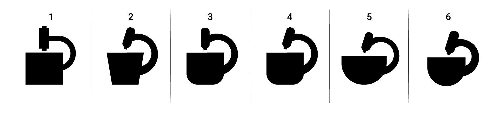
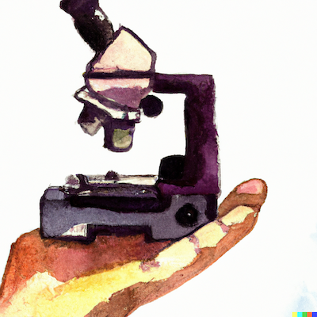
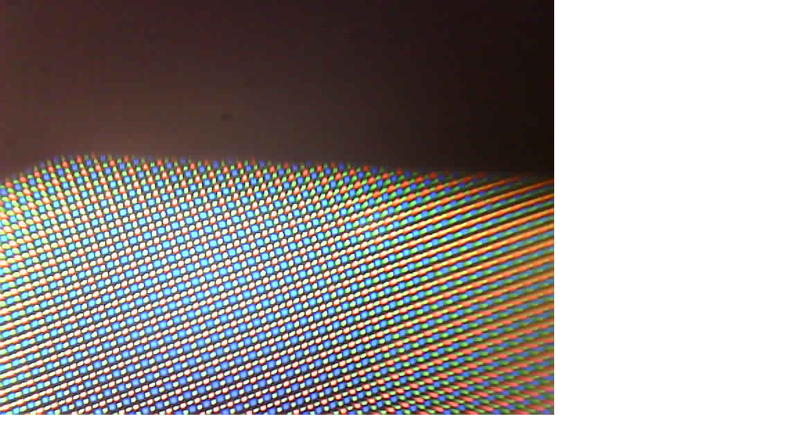
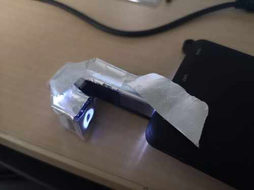
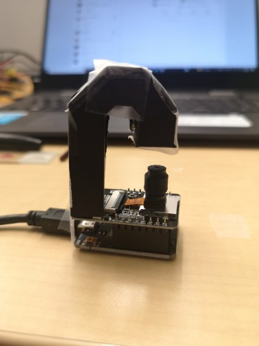

# Introduction

**ESPressoscope: Affordable and Versatile Open-Source Microscopy Platform**

Microscopy has long been an indispensable tool for exploring the hidden intricacies of the microcosm, enabling scientists to investigate, identify, and measure objects at the microscopic scale. However, the accessibility and operational capabilities of modern microscopy equipment have often been hindered by exorbitant costs, limited availability of components, and challenges associated with transportation, particularly in remote or resource-limited settings. To address these challenges, we introduce ESPressoscope, an innovative approach that leverages the power of a $5 open-source microcontroller board, the ESP32-CAM. This platform not only serves as a portable and field-ready digital microscope but also stands as a versatile foundation for a diverse array of imaging applications.

# Enabling Versatility Through a simple and low-cost Microscope

ESP32-CAM's unassuming design belies its potential. By incorporating a few external components, ESPressoscope transforms the ESP32-CAM board into a sophisticated in-situ autonomous time-lapse digital cell imaging platform. This adaptability is showcased across various configurations, spanning from in-lab incubators to underwater microscopy setups, and seamlessly integrating with microfluidic devices and spectrophotometry measurements. The result is a range of modular microscopes, each tailored to specific applications:

- **Matchboxscope/Incubotar-Scope:** A portable brightfield microscope designed for capturing micrographs in the field and within cell incubators. It boasts optical resolutions between 3-4 µm and supports optional z-stacking for enhanced imaging.

- **“Anglerfish”:** This self-contained underwater microscope is engineered for studying biofilm growth beneath the water's surface, unlocking new insights into aquatic ecosystems.

- **“ESPlanktoscope”:** A simplified flow-imaging microscope featuring an integrated peristaltic pump. It offers a cost-effective solution for visualizing dynamic micro-scale fluidic processes.

- **"ESPectrophotometer":** A compact and digital low-cost visible-light spectrometer, catering to applications demanding precise spectroscopic measurements.

- **“HoloESP”:** This compact and economical lens-less holographic microscope ventures into the realm of inline holography, enabling high-resolution reconstructions without the constraints of conventional lenses.

ESP32-CAM's inherent advantages extend beyond versatility. With its low power consumption and compact form factor, ESPressoscope proves ideal for field research, particularly in remote and previously inaccessible environments. The platform's WiFi connectivity provides internet access, allowing seamless integration with cloud-based image processing and storage systems. Furthermore, we introduce a suite of web browser-based tools designed to simplify software management and operation of the microscope.

Through ESPressoscope, we demonstrate the potential of cost-effective, portable microscopy solutions to democratize scientific exploration. This platform transcends barriers, enabling new avenues of research in both biological and analytical applications. ESPressoscope is not merely a microscope; it is an invitation to reimagine microscopy's reach, impact, and affordability.

*

This is the hub for the smallest standalone low-cost open-source DIY microscope system that can be used for a gazillion different applications. Sounds interesting? Continue reading!

The core component of this device is an ESP32 microcontroller packed with a small Camera (OV2460), WiFi, and a microSD card slot, making it a perfect match for your microscopy project. In its minimal version, you only need the ESP32-CAM and perhaps some chewing gum to raise the objective lens and create a finite corrected microscope.

Why raise the lens, and what is a finite corrected microscope, you ask?

## Some theory

### Magnification

*Why can you actually magnify?* Good question! We don't magnify at all, but since the pixels of the OV2460 camera are really small, and we use the objective lens with a relatively small focal length (f'=~5mm), we perform a "4f-imaging". In this context, this means, we have a sample at a distance of 2f (focal lengths) in front of the lens, which will, in turn, create an image at 2f away from it. The camera chip will digitize the image and send it over to your displaying device. You can tune the magnification by changing the distance between the sample-lens and the lens-sensor. The formula is given by:

`M=a'/a`, where `M`is the magnification, `a'` the distance sample-lens, `a` the distance lens-sensor. Further:

`1/f'=1/a' - 1/a`;

You can easily display your phone's screen's ~100µm sized pixels. By tuning the distance, you can play with the field of view, resolution (since the imaging NA changes), and magnification. We don't care about sampling right now, since we do not have much influence on it anyway...

Essentially, this configuration is also known as a finite-corrected microscopy arrangement. It comes with many problems, but we want to keep it simple. Hence we will stick to the basic optical setup here.

### Illumination

The other important part of any microscope is the illumination setup. And also in this case, the ESP32-Cam board is coming to our help.

*Why don't we need any illumination?* Yet another good question. Where there is no light, we won't see anything. Obviously. But: The ESP32 has an insanely strong LED Torch/light that can be switched on/off and even dimmed. Luckily, we can use it to illuminate our sample for transmission microscopy. Wait, how can that be done? Easy! We construct a little periscope/mirror-periscope that simply reflects the light on top of the sample. We have also used other illumination systems like a fiber optic or an Ikea USB LED. The versatility of the system is amazing.

This is how the first periscope illumination looked like. Like an Anglerfish...

And using those two simple tricks (lens distance from the sensor, and illumination), we developed multiple unbelievably cost-effective open hardware microscopes.  

## Outline and Structure of this Wiki

Creating a comprehensive and organized wiki page for the ESPressoscope and its variants is a great idea. Here's a suggested structure for your wiki:

## ESPressoscope Wiki

### 1. Introduction
   - Brief overview of the ESPressoscope project
   - Importance of low-cost open-source microscopes
   - Advantages and applications of the ESPressoscope

### 2. Variants of ESPressoscope
   - Anglerfish
     - Description of underwater imaging capabilities
     - Anglerfish APP User Guide
   - Matchboxscope
     - Simplest microscope variant using microcontroller
     - DIY instructions and features
   - Fluidiscope
     - Microscope with an additional pump
     - Enhanced features and applications
   - Holoscope
     - Inline holography image reconstruction
     - Unique imaging capabilities

### 3. Hardware Components
   - ESP32 camera module
   - SEEED Studio Xiao Sense (UC2-fueld) board
   - Additional components for each variant (e.g., pumps, holography setup)

### 4. Software
   - Firmware:
     - Overview of the firmware
     - Flashing the firmware online
     - Compatibility with different variants
     - Troubleshooting and updates

   - Android App
     - Description of the Android app
     - Installation and setup instructions
     - User guide for using the app with different variants

### 6. Tutorials and Guides
   - Serial Image Stream guide
   - ESP32RawUSBFrame explanation
   - Adding Motor Driver to Xia Sense

## License and Collaboration

This project is open-source and is released under the CERN open hardware license. We encourage everyone who is using our Toolbox to share their results and ideas so that the system keeps improving. It should serve as an easy-to-use and easy-to-access general-purpose building block solution for multiple applications.

You're free to fork the project and enhance it. If you have any suggestions to improve it or add additional functions make a pull request or file an issue.

## Collaborating
If you find this project useful, please like this repository, follow us on Twitter, and cite the webpage! :-)

*Intro image done using DALL-E2
