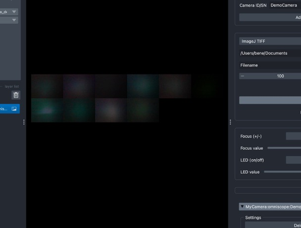
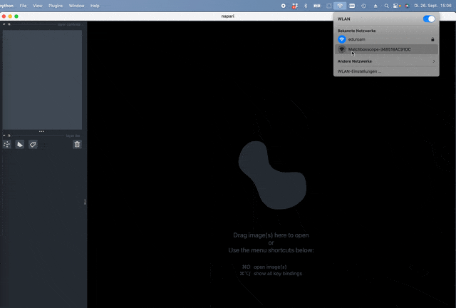

# ESP32 Camera Streaming over WiFi with Python

Stream frames from your ESP32 Camera using WiFi and process them in Python to visualize with Napari.



## Introduction

The ESP32 camera offers both a connection to available networks and the ability to create its own access point. With the aid of a web server, we can seamlessly interact with it using HTTP requests from various platforms, including Python. This tutorial walks you through the process of streaming video from the ESP32 Camera and visualizing it using Napari.


## Prerequisites

### Hardware:
- ESP32 camera module (Tested with Seeed Studio XIAO Sense with the OV2640 camera and also the ESP32-CAM)
- PC with a USB port
- USB cable
- WiFi connection / stick

### Software:
- Python with the necessary libraries installed
- ESP32 Firmware

## ESP32 Setup

### Quickstart

1. Flash your ESP32 with the appropriate firmware [from here](https://matchboxscope.github.io/firmware/FLASH.html).
2. Once flashed, the board attempts to connect to a WiFi network (SSID: Blynk, Password: 12345678). If unsuccessful, it'll create an access point named *Matchboxscope_XXXX*. Connect your computer to this network.
3. Test the stream at: http://192.168.4.1

[Detailed ESP32 code and streaming setup](ESP32_DETAILED_LINK.md) <!-- Link to a detailed setup page if needed -->

## Python Interface

Our key goal is to implement an interface to perform HTTP requests on the ESP32 Server that retrieve JPEG frames as well as setting parameters on the camera side. We have implemented a Napari plugin that was derived from @jacopoabramo's Napari-recorder here https://github.com/Matchboxscope/omniscope-viewer/blob/main/src/omniscopeViewer/control/devices/omniscope.py
It has several stages:
- Discovering available ESPressoscopes
- Starting the stream
- controling parameters
- display the camera stream

Ensure you're working in a Python virtual environment to keep dependencies isolated:

```bash
python3 -m venv esp32env
source esp32env/bin/activate
```

Installation of the omniscope-viewer plugin:
```bash
git clone https://github.com/Matchboxscope/omniscope-viewer/
cd ominiscope-viewer
pip install -e .
```

or

```bash
pip install git+https://github.com/Matchboxscope/omniscope-viewer/
```

### Walkthrough Napari Plugin

Steps to start the viewer:

- Start Napari
- Connect to the ESPressoscope using the Wifi/Accesspoint
- Open the "omniscope-viewer" plugin
- select the `omniscope` (this is designed for a multicamera view, but the ESPressoscope works equally well)
- Wait until the device is discovered (Napari becomes inresponssive for a few seconds)
- Start stream
- Done :)




### Basic concept

The below snippet visualizes the idea of how python retrieves the frames:

```python
def capture_frame(url):
    while True:
        try:
            stream = requests.get(url + ":81", stream=True)
            bytes_ = bytes()
            for chunk in stream.iter_content(chunk_size=8*1024):
                bytes_ += chunk
                a = bytes_.find(b'\xff\xd8')
                b = bytes_.find(b'\xff\xd9')
                if a != -1 and b != -1:
                    jpg = bytes_[a:b+2]
                    bytes_ = bytes_[b+2:]
                    frame = cv2.imdecode(np.frombuffer(jpg, dtype=np.uint8), cv2.IMREAD_COLOR)
                    # Here, integrate with Napari or any other visualizer of your choice
        except (requests.exceptions.RequestException) as e:
            print("Error occurred:", e)
            time.sleep(5)
```

The requests package performs a get-request on the address `192.168.4.1:81` and converts the returning bytes into an image.
By calling this function repeatetly a stream can be converted into several RGB numpy frames. The original code is designed to also display multiple cameras, hence we call it omniscope, but the result is the same. the images just get concatenated to form a grid instead.


The discovery works by pinging all IP addresses within a subnet and trying to get an answer for the keyworkd "omniscope" or "cam_name" when requesting the URL 192.168.4.1/status
The returning dictionary looks for example like this:
{"lamp":100,"autolamp":1,"min_frame_time":0,"framesize":8,"quality":12,"xclk":8,"brightness":-1,"contrast":0,"saturation":0,"sharpness":0,"special_effect":0,"wb_mode":0,"awb":0,"awb_gain":1,"aec":0,"aec2":1,"ae_level":-1,"aec_value":797,"agc":0,"agc_gain":5,"gainceiling":2,"bpc":0,"wpc":1,"raw_gma":1,"lenc":0,"vflip":0,"hmirror":0,"dcw":1,"colorbar":0,"cam_name":"Matchboxscope","code_ver":"Apr 17 2023 @ 09:18:49","rotate":"0","stream_url":"http://192.168.137.69:81/","anglerfishSlider":"1"}
You can try it out yourself


For a more advanced interface and multi-camera setup, refer to the [Omniscope project](https://github.com/Matchboxscope/omniscope-viewer).


#### More theory on Accessing ESP32 Camera Frames Using Python and REST API

This is a bit more explanation on how you can access the frames

1. **Setup the Environment**:

    First, ensure you've set up your Python environment and installed the required libraries:

    ```bash
    pip install requests opencv-python numpy
    ```

2. **Sending an HTTP Request to Retrieve a Frame**:

    The ESP32 camera, when set up as an HTTP server, can provide frames as JPEG images in response to specific requests. One common endpoint might be `/capture`, which returns a single JPEG frame.

    ```python
    import requests
    import cv2
    import numpy as np

    # Define the camera's API endpoint
    CAMERA_ENDPOINT = "http://192.168.4.1/capture"

    # Fetch the JPEG image from the ESP32 camera
    response = requests.get(CAMERA_ENDPOINT)

    # Check if the request was successful
    if response.status_code == 200:
        # Convert the image bytes to a numpy array
        image_np_array = np.frombuffer(response.content, dtype=np.uint8)

        # Decode the numpy array into an image
        image = cv2.imdecode(image_np_array, cv2.IMREAD_COLOR)

        # Display the image
        cv2.imshow('ESP32 Camera Frame', image)
        cv2.waitKey(0)
        cv2.destroyAllWindows()
    else:
        print(f"Failed to retrieve image. HTTP Response Code: {response.status_code}")
    ```

    The script above does the following:

    - Sends a GET request to the `/capture` endpoint of the ESP32 camera.
    - If successful (HTTP status code 200), it converts the JPEG byte data into a numpy array.
    - Using OpenCV, the numpy array is then decoded into an actual image, which can be displayed or processed further.

3. **Streaming Frames**:

    To continuously fetch and display frames (essentially streaming the video feed), you can place the request and image processing code inside a loop. You might also want to include error-handling mechanisms to handle scenarios where a frame might not be fetched successfully.

    ```python
    while True:
        response = requests.get(CAMERA_ENDPOINT)

        if response.status_code == 200:
            image_np_array = np.frombuffer(response.content, dtype=np.uint8)
            image = cv2.imdecode(image_np_array, cv2.IMREAD_COLOR)

            cv2.imshow('ESP32 Camera Stream', image)

            # Break the loop if 'q' key is pressed
            if cv2.waitKey(1) & 0xFF == ord('q'):
                break
        else:
            print(f"Failed to retrieve image. HTTP Response Code: {response.status_code}")

    cv2.destroyAllWindows()
    ```

    This script continuously requests frames and displays them, giving the appearance of streaming. Pressing the `q` key will stop the streaming and close the display window.


## Conclusion

You've now established a connection between the ESP32 camera and Python to visualize the streaming data using Napari. Explore more, adapt, and expand based on your needs!

## Feedback & Community

Your contributions are invaluable! Share results, raise questions, or suggest modifications by creating an issue in the [repository](https://github.com/Matchboxscope/matchboxscope-simplecamera/issues).
