# DIY Motorized Microscope with Seeed Studio XIAO Sense

Building unique DIY projects is not only fulfilling but also helps in honing skills and understanding the components better. In this tutorial, we're going to walk you through the steps of turning the Seeed Studio XIAO Sense into a motorized microscope.

### Background:

The XIAO's diminutive size presents a challenge for adapting bipolar stepper motors, mainly because of the lack of a specific adapter board. Most stepper motor drivers, like those from Trinamic or the A4988, typically require a voltage greater than 6V, but XIAO, through USB, supports only 5V.

Nevertheless, the XIAO Sense's footprint coincidentally aligns with the common stepper driver layout. Leveraging this and my desire for minimal additional work, I've created a modification where an A4988 driver board and a Pololu step-up converter (from 5V to 12V) are attached to the XIAO. This modification aims to drive small stepper motors to focus the microscope lens.

## Materials:

Here's what you'll need:

- Xiao Sense ESP32S3 board
- A4988 or TMC driver
- 2 wires
- Pololu U3V16F12 step up converter (5V->12V) [Buy Here](https://eckstein-shop.de/Pololu-12V-Step-Up-Voltage-Regulator-Spannungsregler-U3V16F12?googlede=1&gclid=CjwKCAjwxOymBhAFEiwAnodBLEc5hGNNLyPqjgnipfdSq02DWteRHEU8KiYmO-bzoIoDtpCwcYBkCxoCe44QAvD_BwE)

## Assembly:

### 1. Wiring the XIAO to the Stepper Driver:

For a comprehensive guide on this, consider checking out the official [Seeed Studio documentation](https://wiki.seeedstudio.com/xiao_esp32s3_camera_usage/).

**Pin Assignments for a solder-less configuration:**
- enable -> d6
- m1 -> D5
- m2 -> d4
- m3 -> d3
- notreset -> d2
- notsleep -> d1
- step -> d0
- dir -> d7 (using a wire)

In addition, connect the step-up converter to the VDD and GND. Then bridge the 12V to VMot with a wire.

### 2. Visual Guide:

#### All Components Laid Out:

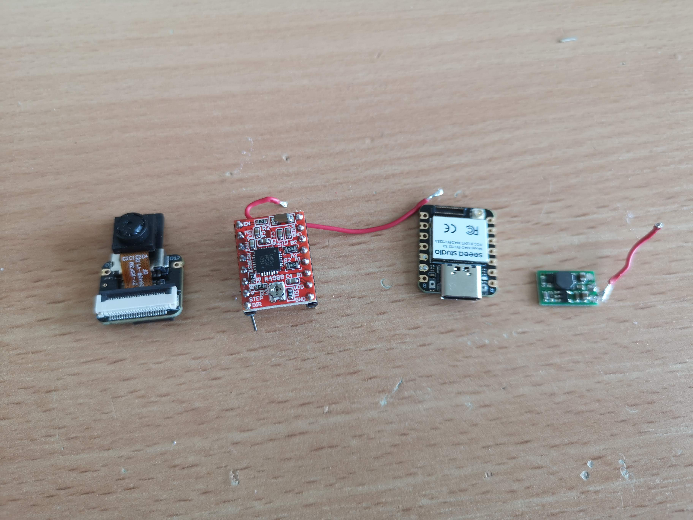

#### Pins Ready to be Bent:

Ensure you align them correctly.

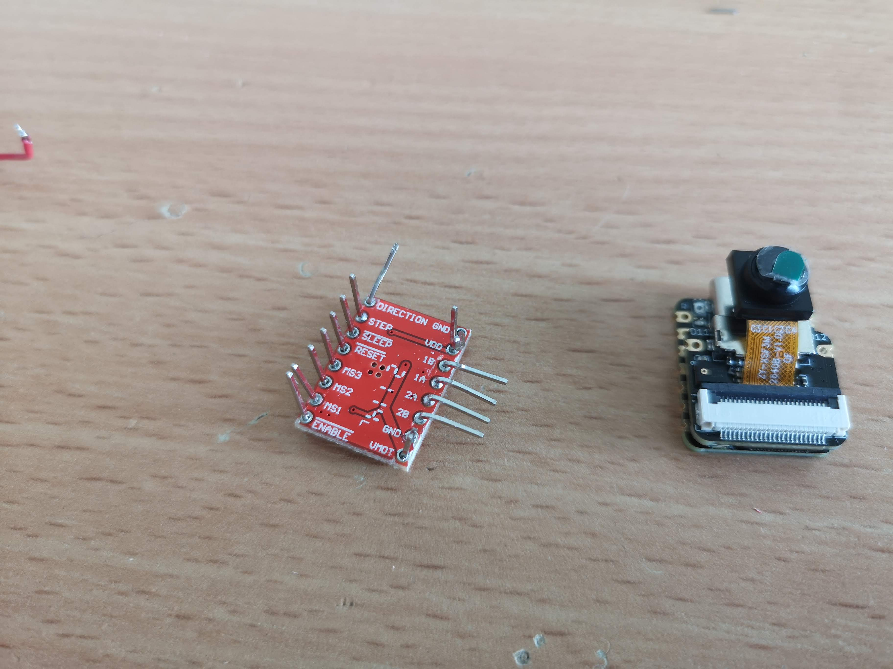

#### Combine XIAO and Stepper Driver:

It should look something like this:

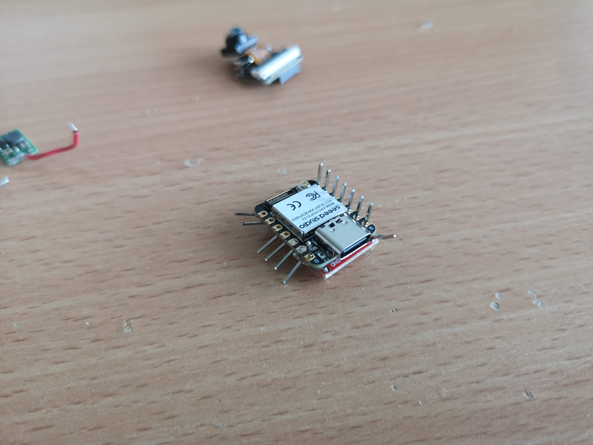

Make sure the pins for GND/VDD aren't causing a short-circuit:

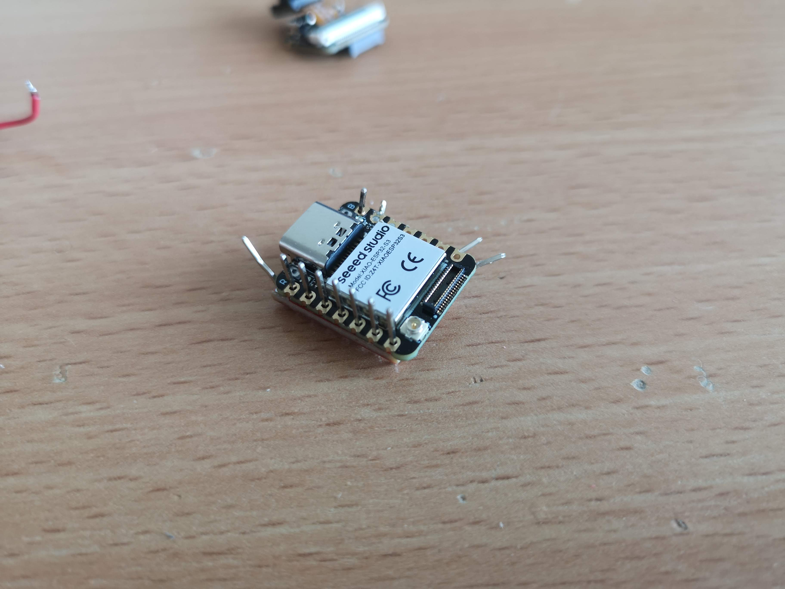

#### Linking VMotor with the Step-up Converter:

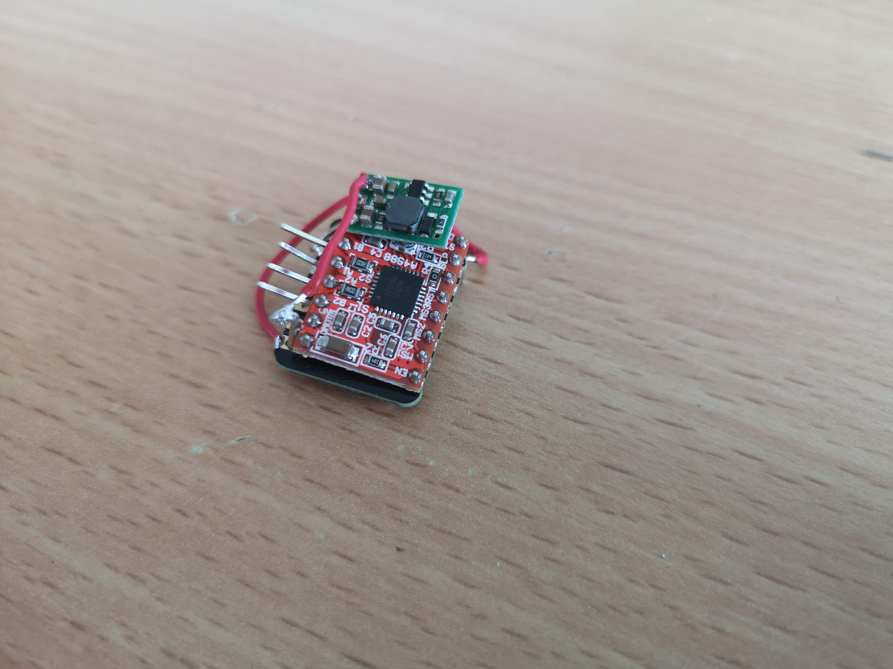

#### Bridging the Direction Pin:

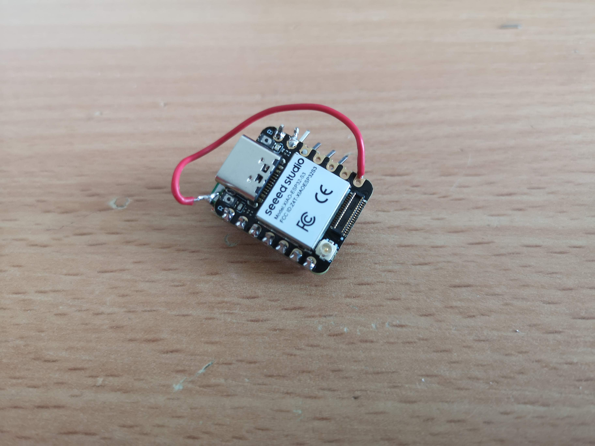

#### Connecting the Motor:

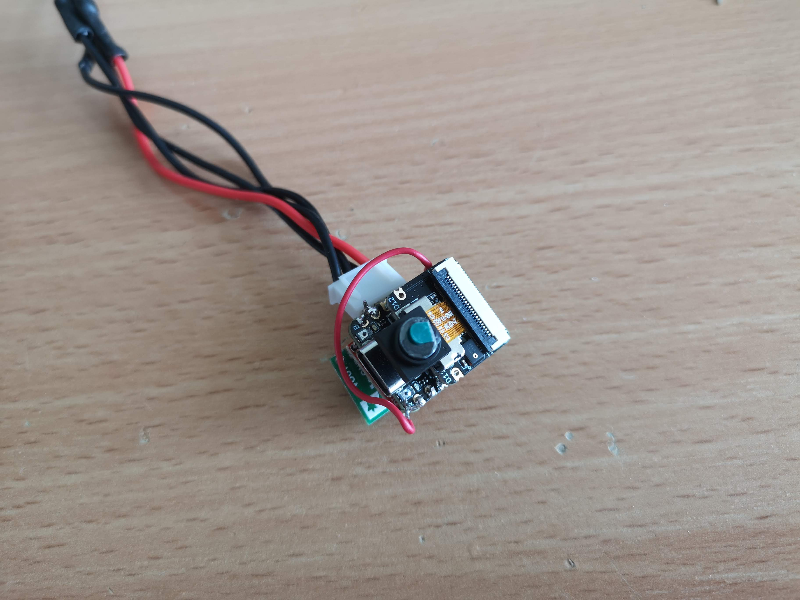

### 3. Final Assembly:

Integrate the XIAO in a matchboxscope setup:

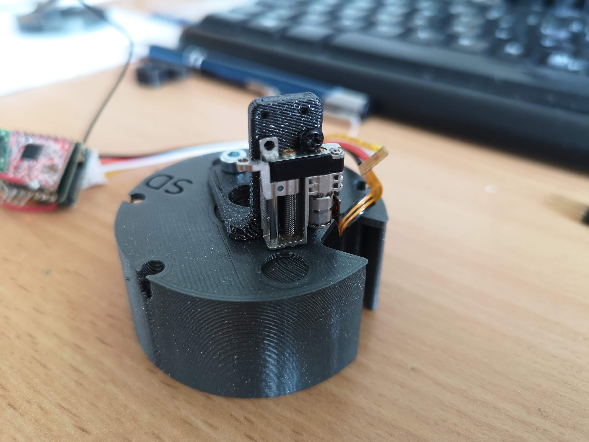

Various angles of the setup:

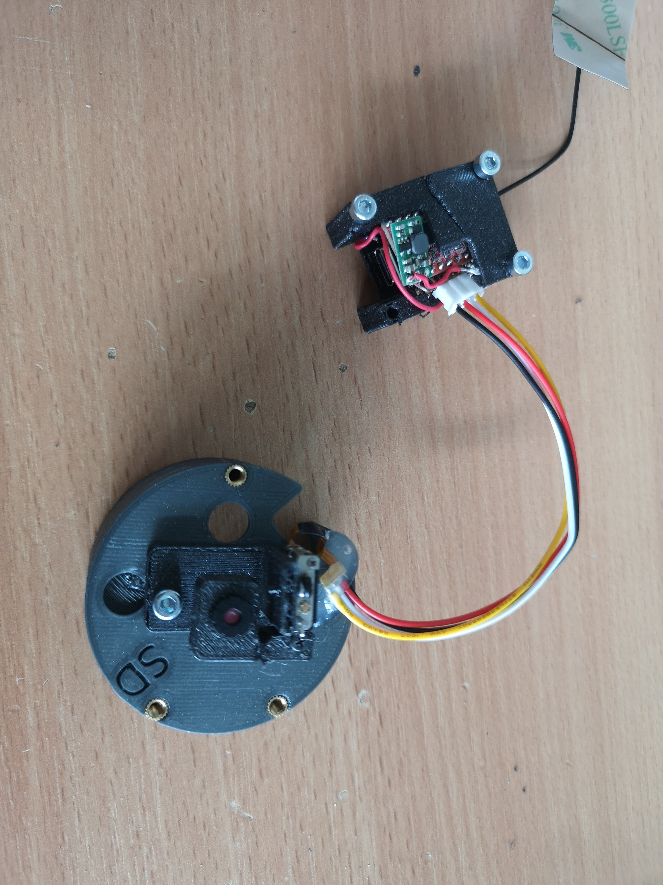

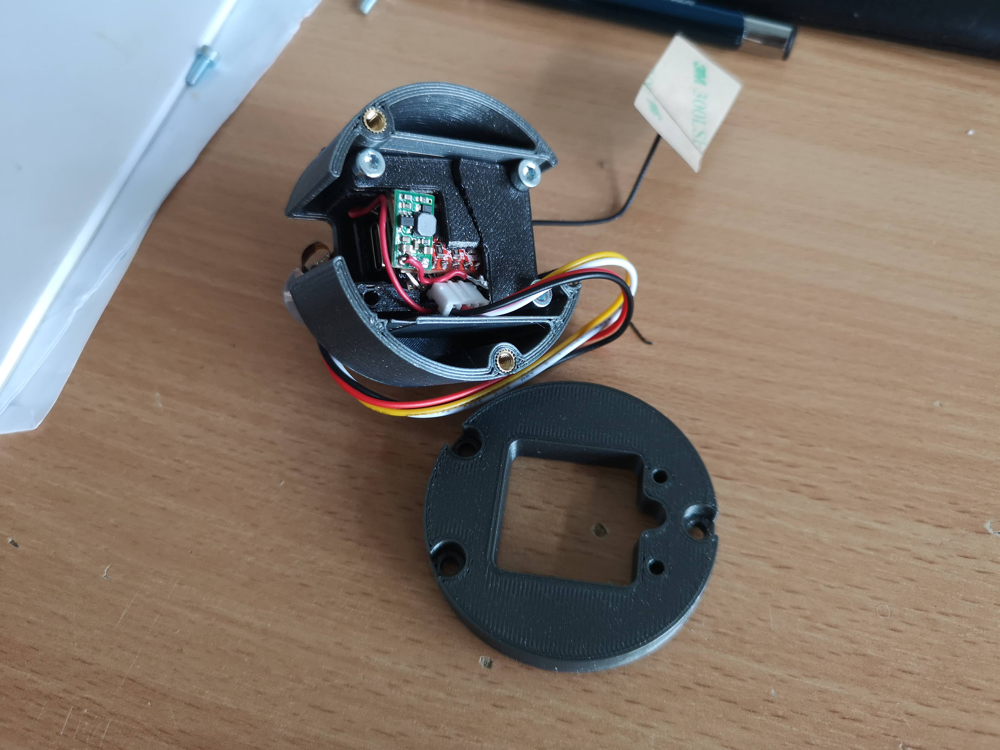

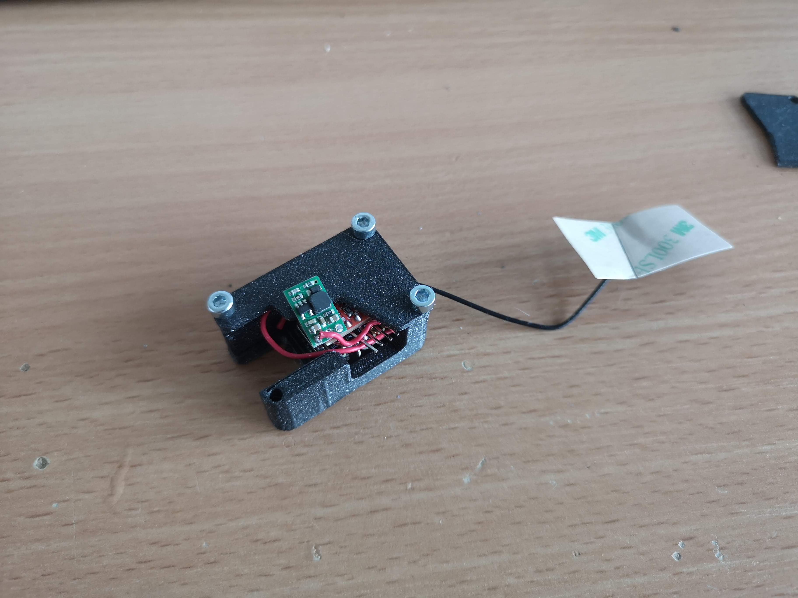

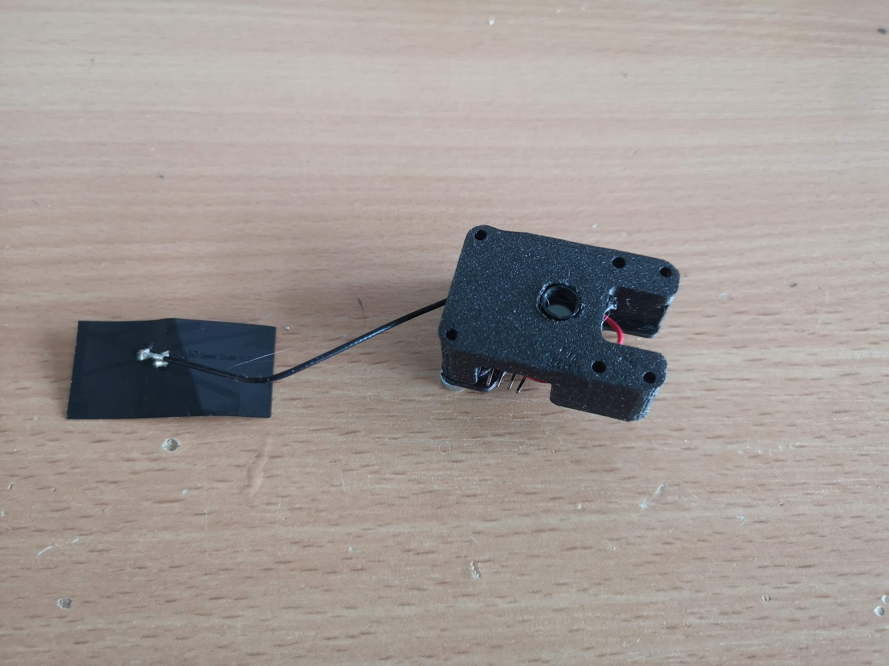

## Coding:

Example code to move it. The simple camera server will have it shortly.
https://github.com/Matchboxscope/matchboxscope-simplecamera

```cpp
#include <AccelStepper.h>

// Define pin assignments
#define ENABLE_PIN 6
#define M1_PIN 5
#define M2_PIN 4
#define M3_PIN 3
#define NOTRESET_PIN 2
#define NOTSLEEP_PIN 1
#define STEP_PIN 0
#define DIR_PIN 7

// Create an instance of AccelStepper
// AccelStepper::DRIVER means we're driving the motor directly without any additional hardware interface
AccelStepper stepper(AccelStepper::DRIVER, STEP_PIN, DIR_PIN);

void setup() {
  // Set pin modes
  pinMode(ENABLE_PIN, OUTPUT);
  pinMode(M1_PIN, OUTPUT);
  pinMode(M2_PIN, OUTPUT);
  pinMode(M3_PIN, OUTPUT);
  pinMode(NOTRESET_PIN, OUTPUT);
  pinMode(NOTSLEEP_PIN, OUTPUT);

  // Set pins to default states
  digitalWrite(ENABLE_PIN, LOW); // Assuming low enables the motor driver
  digitalWrite(M1_PIN, HIGH);    // These values might need adjustments based on your specific motor/driver configuration
  digitalWrite(M2_PIN, HIGH);
  digitalWrite(M3_PIN, HIGH);
  digitalWrite(NOTRESET_PIN, HIGH); // Assuming high means not resetting
  digitalWrite(NOTSLEEP_PIN, HIGH); // Assuming high means not sleeping

  // Set up the stepper properties
  stepper.setMaxSpeed(1000);   // Set max speed (steps per second). Adjust based on your needs.
  stepper.setAcceleration(500); // Set acceleration (steps per second^2). Adjust based on your needs.
}

void loop() {
  // Rotate stepper to position 2000
  stepper.moveTo(2000);
  while (stepper.distanceToGo() != 0) {
    stepper.run();
  }

  delay(1000); // Wait for a second

  // Rotate stepper back to position 0
  stepper.moveTo(0);
  while (stepper.distanceToGo() != 0) {
    stepper.run();
  }

  delay(1000); // Wait for a second
}
```

## Watch it in Action:

See the linear stage move:

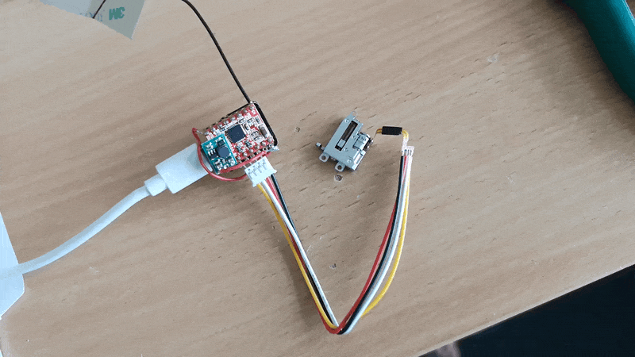

And here it is, lifting the objective lens:

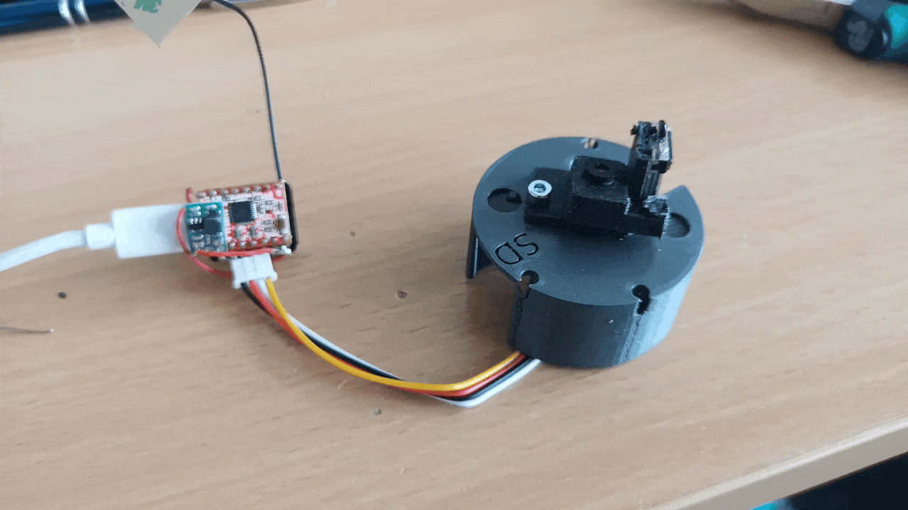

---

And there you have it! A DIY motorized microscope leveraging the Seeed Studio XIAO Sense. Happy tinkering!
