More coming soon.

### Bill of materials

## 3D printing files

# Assembly of the spectrometer

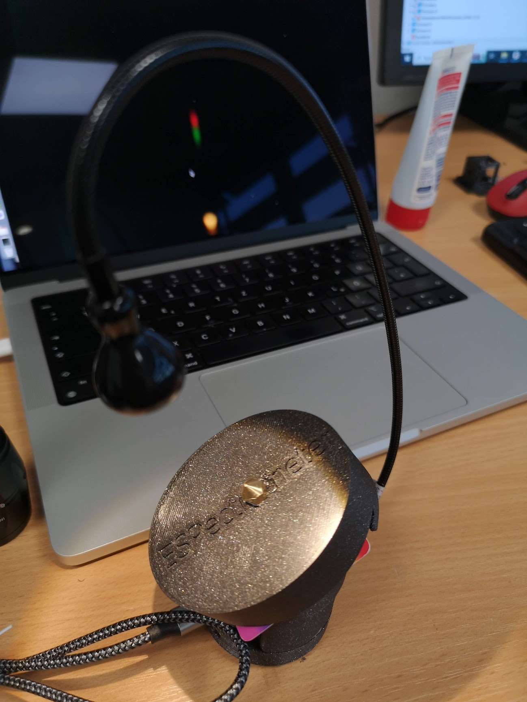

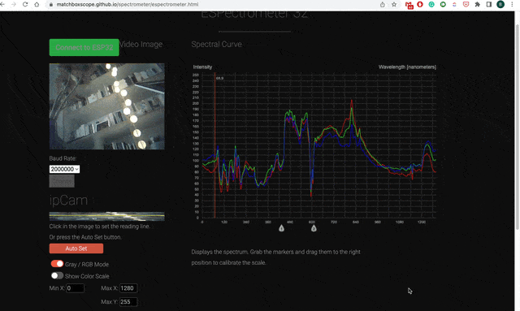
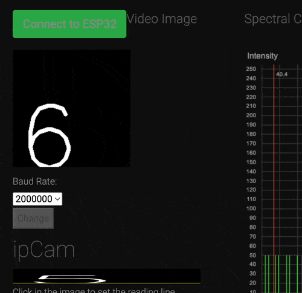

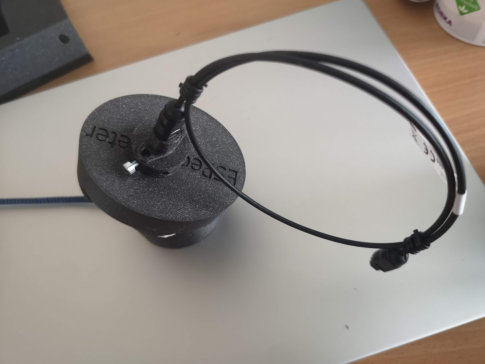
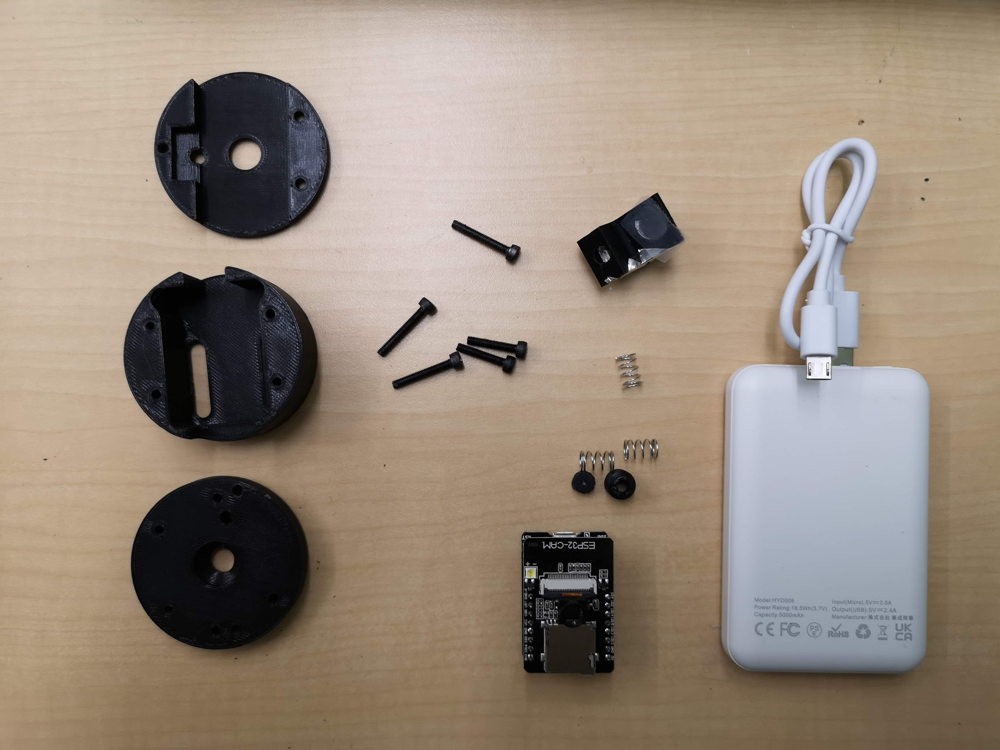
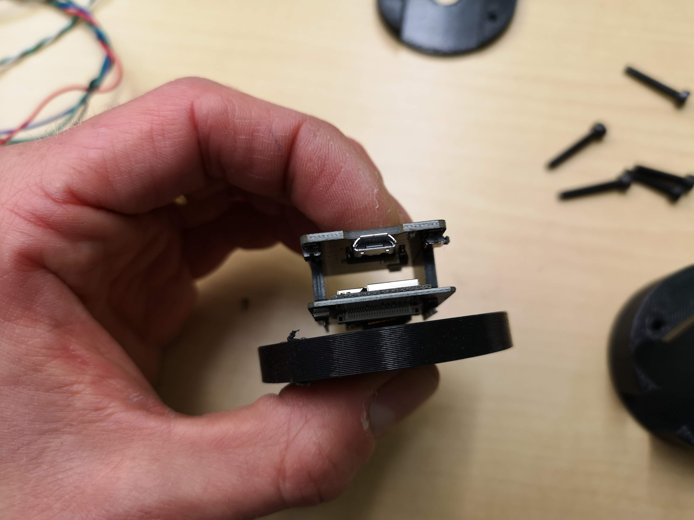
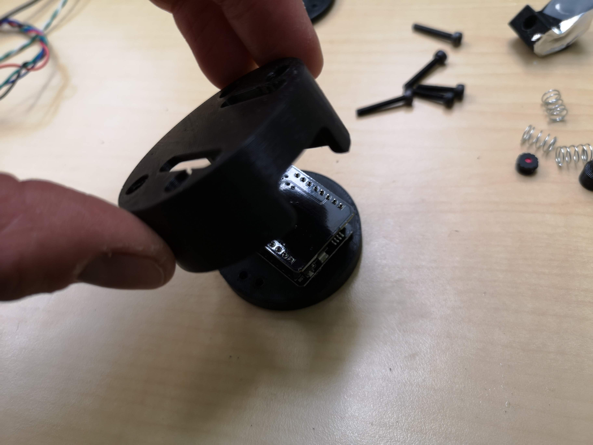
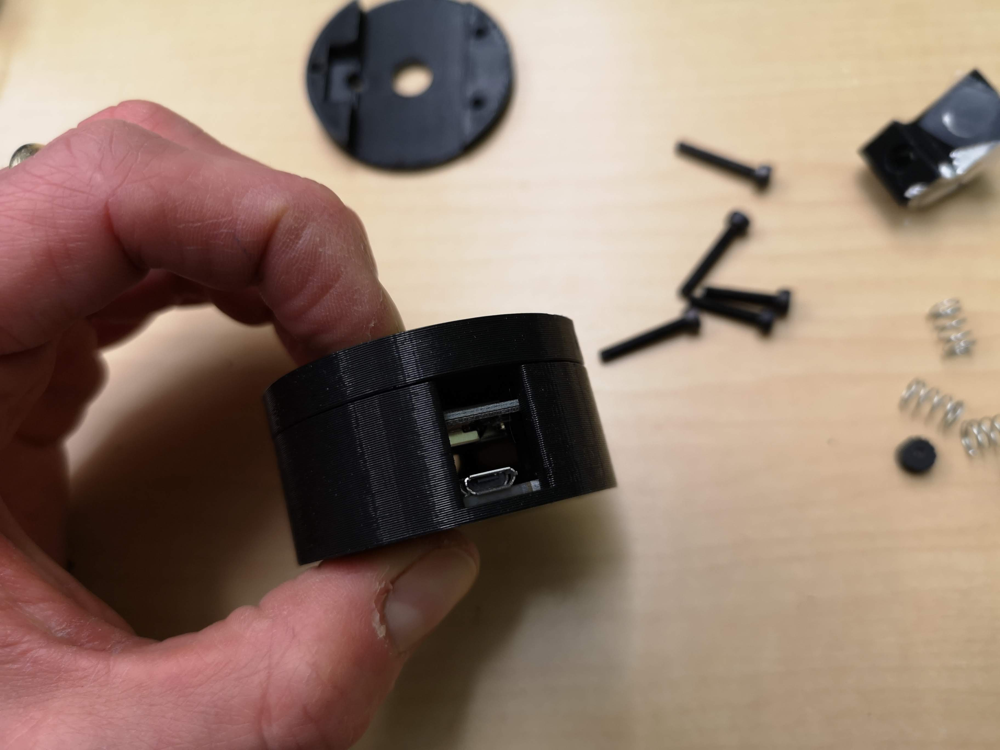
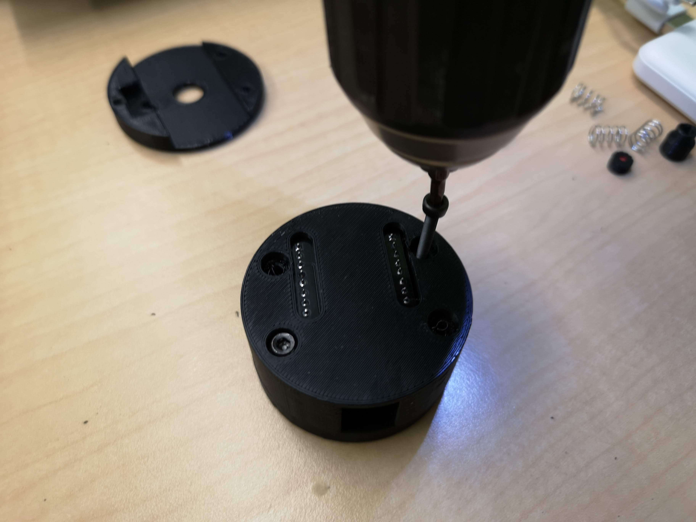
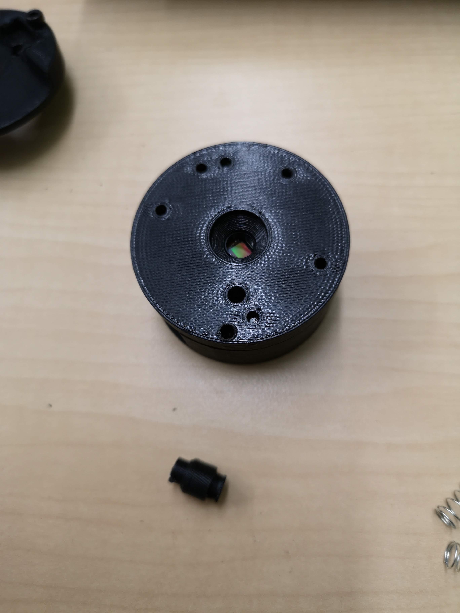
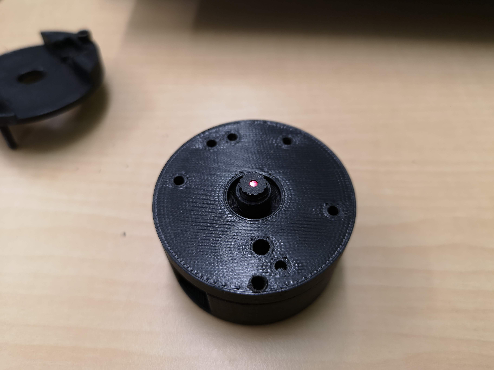
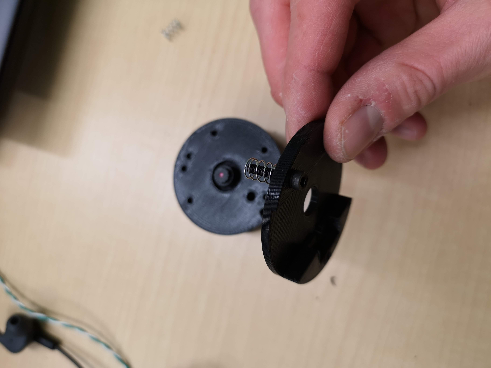
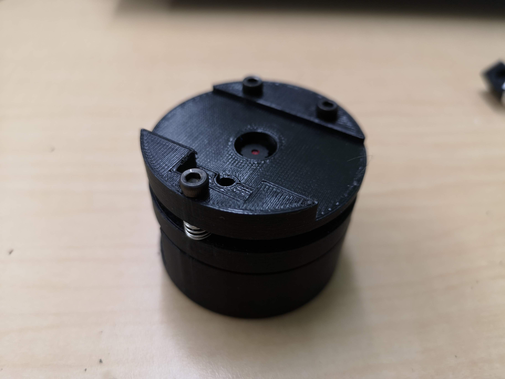
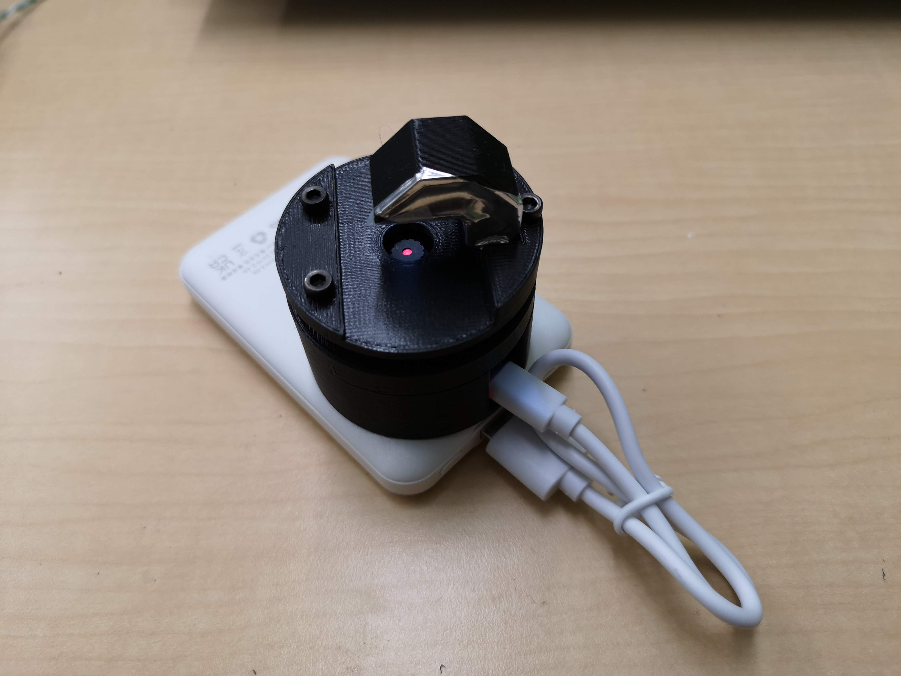

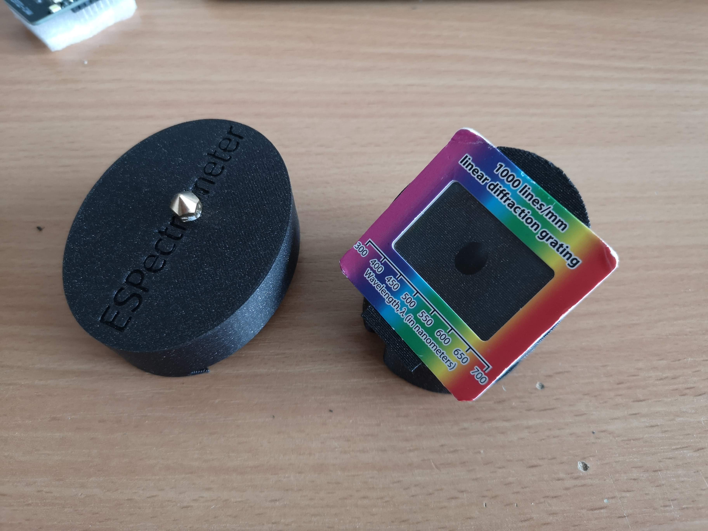

## CAD Files

The release files can be found https://github.com/Matchboxscope/Matchboxscope/releases/download/ESPMicroscopeCollectionv2/CAD_ESPECTROMETER.zip
