# ESPectrometer

## Introduction

The ESPectrometer is an innovative, cost-effective tool for spectroscopy, ideal for educational purposes. It combines the power of the ESP32-CAM module with simple yet effective components to create a spectrometer. The key elements include a low-cost diffraction grating, a nozzle from a 3D printer to serve as a slit, and a fiber optic cable from an audio amplifier to direct light. This setup is inspired by similar projects, such as the one by Public Lab, making it an accessible choice for those interested in exploring the world of spectroscopy.

## Working Principle

A spectrometer works by splitting light into its constituent wavelengths. In a grating spectrometer, a diffraction grating does this job. When light passes through the grating, it's diffracted at different angles depending on its wavelength. This results in a spectrum, where each color (or wavelength) is spread out spatially. This spread is then captured by the ESP32-CAM's sensor, allowing for analysis of the light's spectral composition.

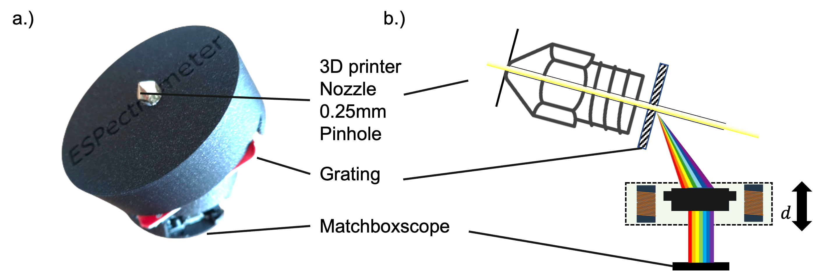

### Bill of Materials

| Item | Link | Cost |
| --- | --- | --- |
| Diffraction Grating, 1000l/mm | [Amazon](https://www.amazon.de/Astromedia-Durchlicht-Beugungsgitter-1-000-Linien/dp/B076XWCLCR) | 5€ |
| 0.1mm 3D Printing Nozzle | [Amazon](https://www.amazon.de/Astromedia-Durchlicht-Beugungsgitter-1-000-Linien/dp/B076XWCLCR) | 1€ |
| ESP32 CAM | [BerryBase](https://www.berrybase.de/esp32-cam-development-board-inkl.-ov2640-kameramodul) | 10€ |

## 3D Printing Files

The 3D printing files for the spectrometer components are available at:

[Matchboxscope Releases](https://github.com/Matchboxscope/Matchboxscope/releases/download/ESPMicroscopeCollectionv2/CAD_ESPECTROMETER.zip)

Here's a model in Autodesk Inventor:

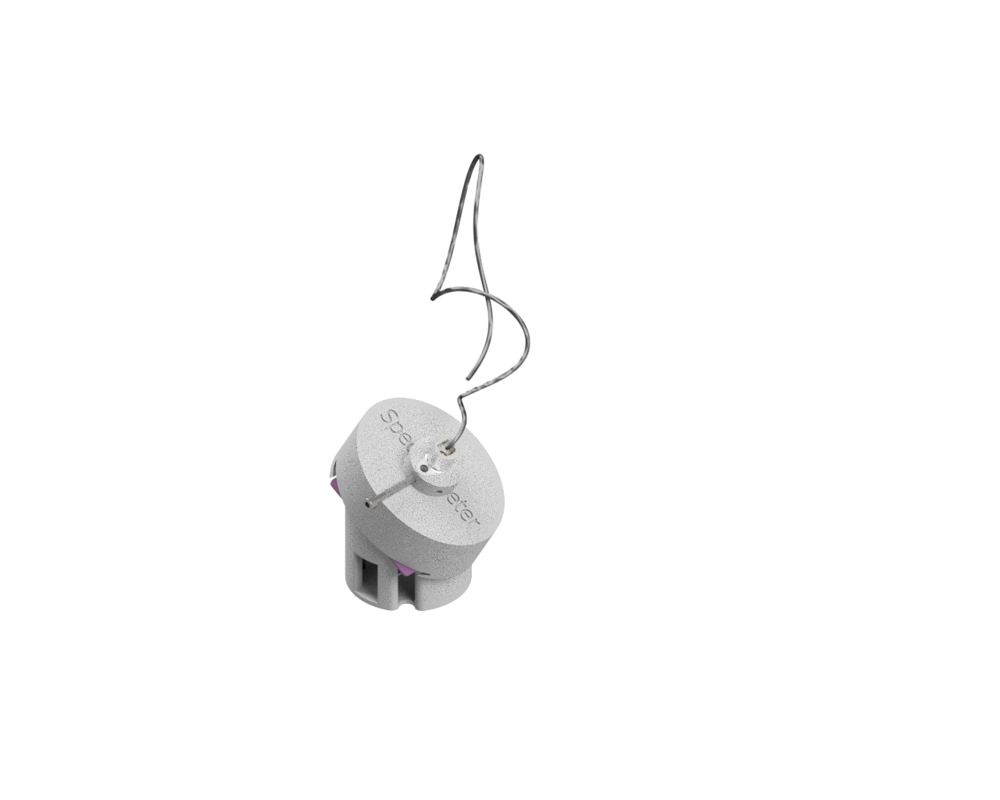

## Assembly of the Spectrometer

### Parts and Initial Setup

1. **Parts Overview**:

    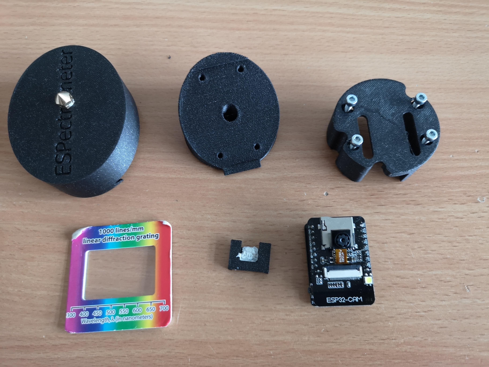

2. **Attaching the Camera Spacer**:

    Attach the camera spacer to the ESP32 board.

    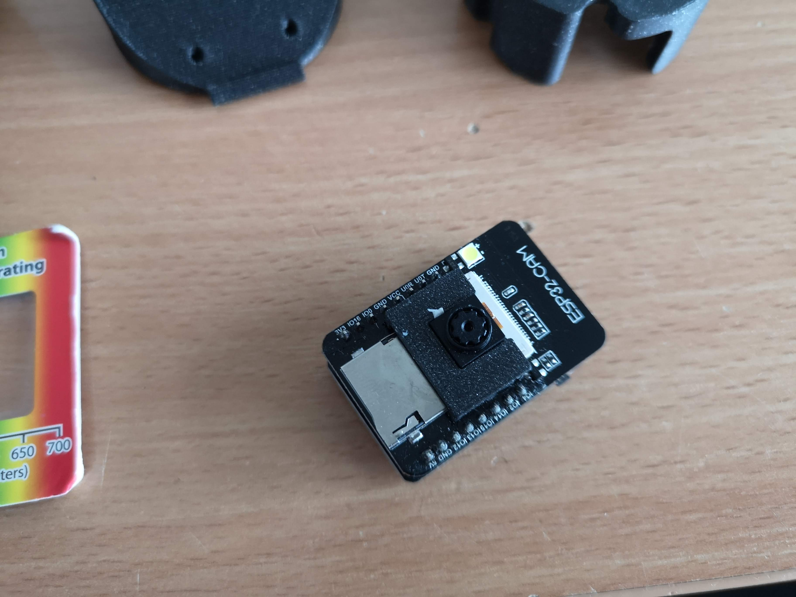

3. **Camera Installation**:

    Place the camera into the base.

    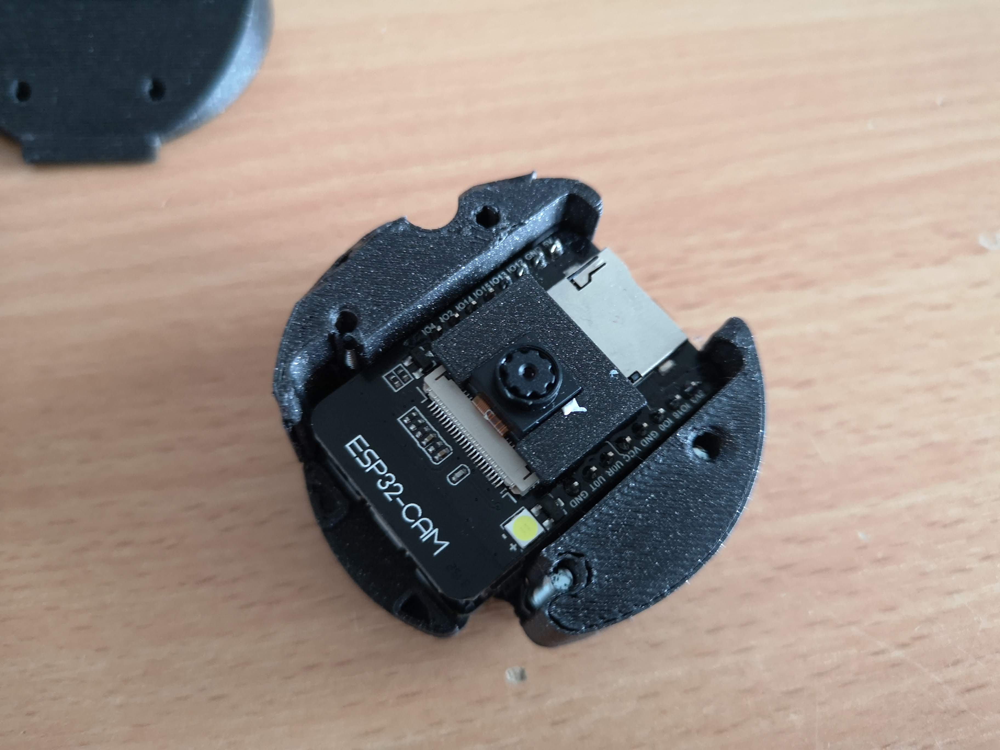

4. **Assembling the Top Layer**:

    Attach the top layer to the baseplate, ensuring the camera is visible through the hole.

    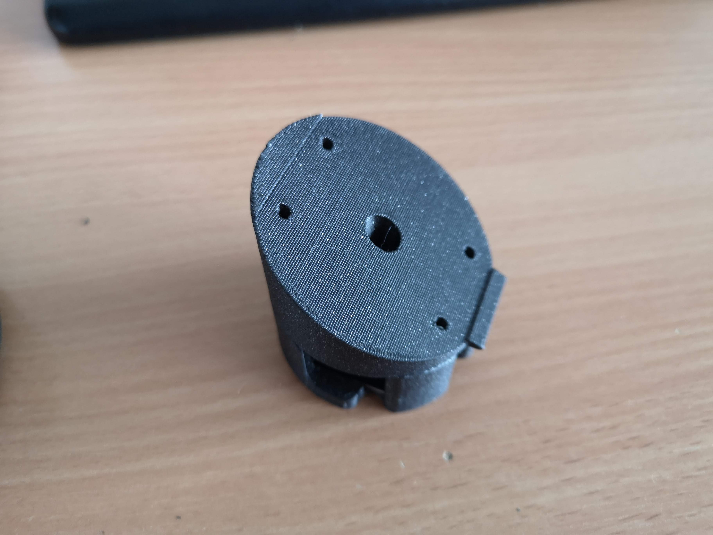

5. **Adding the Grating**:

    Install the diffraction grating onto the top layer, making sure it is correctly oriented.

    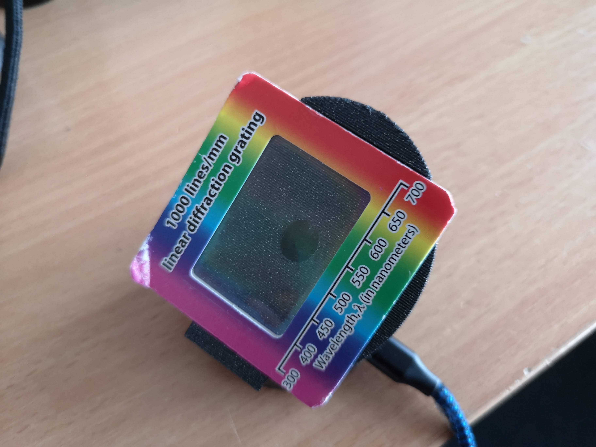

6. **Slit Layer Installation**:

    Slide the slit layer (3D printed nozzle) over the grating.

    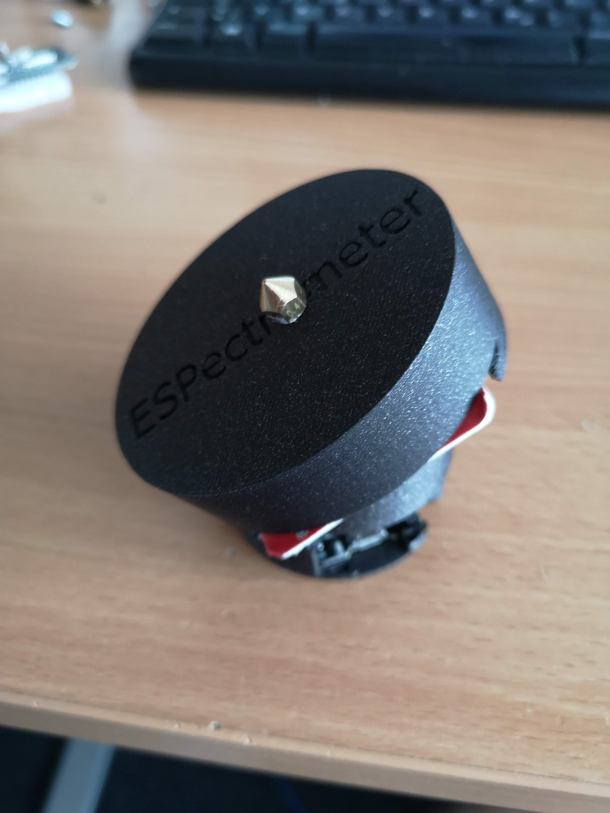

7. **Optional Fiber Optic Setup**:

    For directional independence, attach the fiber optic cable.

    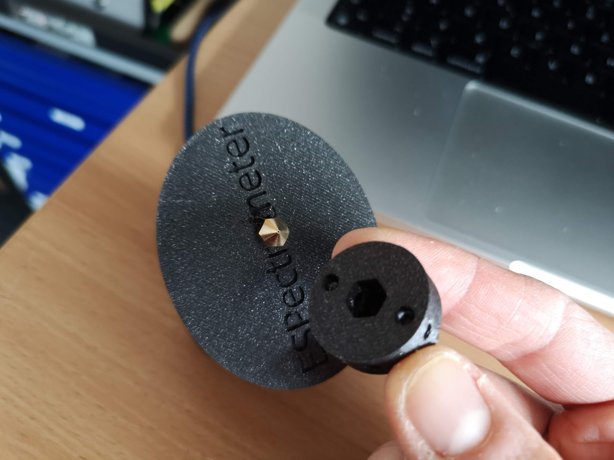

    Then add the adapter and fiber.

    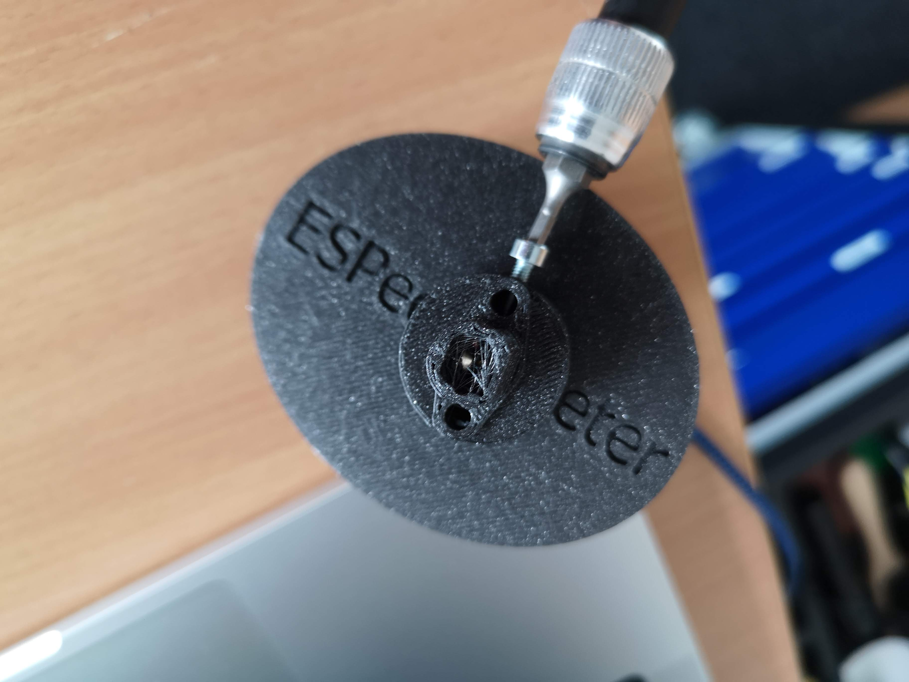

8. **Final Assembly**:

    With all components in place, the spectrometer assembly is complete.

    

## Software

- **Firmware Installation**:

    Flash the firmware on the ESP32-CAM (not suitable for XIAO) from [Matchboxscope Firmware](https://matchboxscope.github.io/firmware/FLASH.html).

- **Web Interface**:

    Access the ESPectrometer interface through Chrome at [Matchboxscope Spectrometer](https://matchboxscope.github.io/blob/main/static/spectrometer/espectrometer.html). The camera stream should appear on the left.

- **Using the Spectrometer**:

    Move the lineplot section to where you see the "rainbow". This lineplot represents the spectrum.

    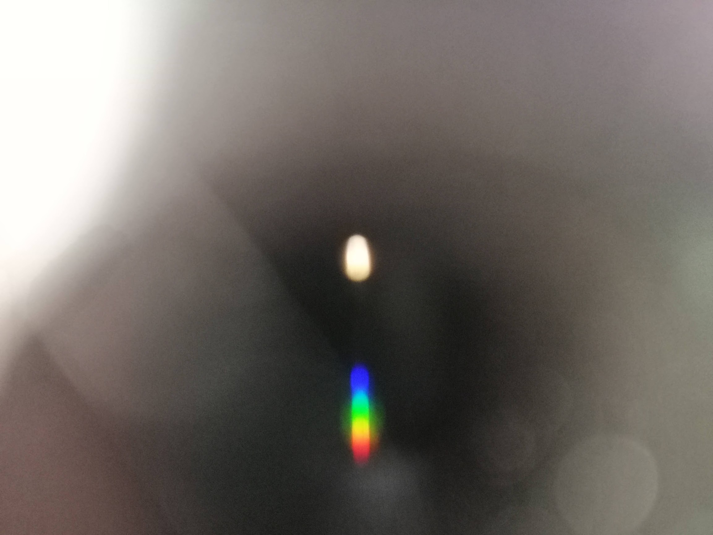

- **Calibration**:

    Calibrate the spectrometer using a known light source, such as a halogen lamp.

- **Visualizing Different Light Sources**:

    Compare the spectra of different light sources,

 such as LED vs. Laser, and observe how the camera image changes.

    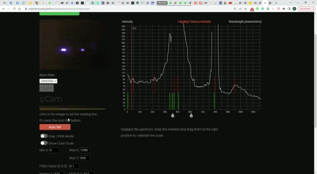

This tutorial provides a comprehensive guide to building and operating your own ESPectrometer, a fantastic tool for educational and hobbyist applications in spectroscopy.
