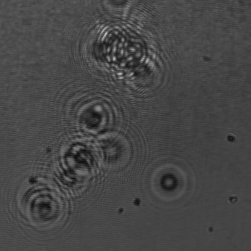

# ESP32-based InLine Holography Microscope

TEXT

# Assembly

TEXT


### Bill of material


Part |  Purpose | Source | Price |
:----------------:|:------------:|:----------------:|:------------:


## 3D printing files

All design files can be found in the release from the [Matchboxscope Releases](https://github.com/Matchboxscope/Matchboxscope/releases/tag/ESPMicroscopeCollectionv2) (Look for miniplanktoscope).

All 3D-printable files can be found [here](./STL/Anglerfish_JAR):

## CAD Files

The release files can be found https://github.com/Matchboxscope/Matchboxscope/releases/download/ESPMicroscopeCollectionv2/CAD_PlanktoscopeMini.zip

## Assembly Process


## Reconstruction code:

```py
#!/usr/bin/env python3
# -*- coding: utf-8 -*-
"""
Created on Thu Jun 22 22:00:20 2023

@author: bene
"""


import numpy as np
import matplotlib.pyplot as plt
import NanoImagingPack as nip

def reconstruct_inline_hologram(hologram, wavelength, ps, distance):

# Inverse space
     Nx = hologram.shape[1]
     Ny = hologram.shape[0]
     fx = np.linspace(-(Nx-1)/2*(1/(Nx*ps)), (Nx-1)/2*(1/(ps*Nx)), Nx)
     fy = np.linspace(-(Ny-1)/2*(1/(ps*Ny)), (Ny-1)/2*(1/(ps*Ny)), Ny)
     Fx, Fy = np.meshgrid(fx, fy)

     kernel = np.exp(1j*(2 * np.pi / wavelength) * distance) * np.exp(1j * np.pi * wavelength * distance * (Fx**2 + Fy**2))

     # Compute FFT centered about 0
     E0fft = np.fft.fftshift(np.fft.fft2(hologram))

     # Multiply spectrum with fresnel phase-factor
     G = kernel*E0fft
     Ef = np.fft.ifft2(np.fft.ifftshift(G))
     return Ef


imgHolo = plt.imread('/Users/bene/Downloads/ecoli.jpeg')
imgHolo = imgHolo/nip.gaussf(imgHolo, 25)

for iz in np.linspace(1,10,50):
    img=reconstruct_inline_hologram(imgHolo[:,:,2], wavelength=450e-9, ps=5e-6 , distance=iz*1e-3)
    plt.imshow(np.abs(img), cmap='gray'), plt.title("dz"+str(iz*1e-3))
    plt.savefig("ecoliDefocusEsp32"+str(iz)+".png")
    plt.show()
```

## Reults



